# Event Switchyard 設計図（差し替え後・完全版）

## 1. このシステムの立ち位置（前提）

Event Switchyard は **取引所（Exchange）ではない**。  
本プロジェクトは **Strategy(App) + Execution Gateway/SOR(Gateway) + BackOffice** の3層構成で、  
**Gateway が Execution Gateway / Smart Order Router（SOR）** として動作する。

- App（手動 or 自動）から注文を受信
- リスクチェックを同期的に実施（受理/却下）
- 受理した注文をFast Pathに載せて外部取引所へ送信
- 約定結果（Execution Report）を受信
- 監査証跡（append-only）を保持（replay可能）
- バックオフィス・監視系へ非同期配信
- 外部公開はGatewayのみ（App/BackOffice は内部ネットワークに配置）
- HTTPレスポンスは受理（ACK）まで
- 約定・部分約定・取引所拒否は 非同期通知
  - WebSocket / SSE / Kafka / Polling 等

---

## 2. 全体フロー（技術視点）

### 2.1 コンポーネント構成

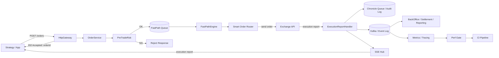

### 2.2 技術シーケンス（Fast Path / Async Path 分離）

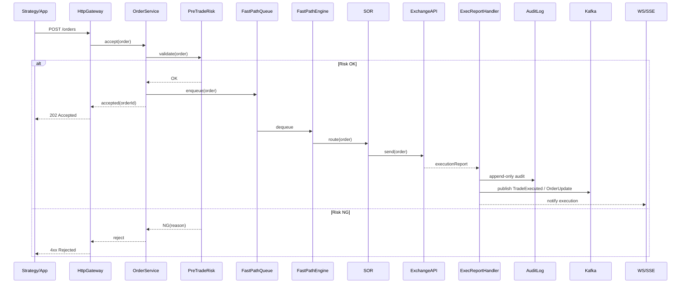

### 2.3 現行実装のソースフロー（app側）

- エントリーポイント: `app/src/main/kotlin/app/Main.kt` -> `app/src/main/kotlin/app/http/HttpIngress.kt`
- 注文API: `app/src/main/kotlin/app/http/OrderController.kt` -> `app/src/main/kotlin/app/engine/Router.kt`（ローカル判定） -> `app/src/main/kotlin/app/order/OrderExecutionService.kt` -> `app/src/main/kotlin/app/clients/gateway/GatewayClient.kt`（/orders）
  - リアルタイム更新: `app/src/main/kotlin/app/clients/gateway/GatewaySseClient.kt` -> `app/src/main/kotlin/app/http/OrderController.kt`
  - フォールバック: `OrderExecutionService.fetchOrder` で PENDING の再同期
- 自動戦略: `app/src/main/kotlin/app/strategy/StrategyAutoTrader.kt` -> `app/src/main/kotlin/app/fast/TradingFastPath.kt` -> `app/src/main/kotlin/app/fast/handlers/OrderSubmissionHandler.kt` -> `app/src/main/kotlin/app/order/OrderExecutionService.kt` -> `GatewayClient`
- ローカルFast Path（任意）: `app/src/main/kotlin/app/engine/Router.kt` -> `app/src/main/kotlin/app/fast/FastPathEngine.kt`
  - 永続化: `app/src/main/kotlin/app/fast/PersistenceQueue.kt` -> `app/src/main/kotlin/app/kafka/ChronicleQueueWriter.kt` -> `app/src/main/kotlin/app/kafka/KafkaBridge.kt`
  - 即時マッチ: `app/src/main/kotlin/app/http/MarketDataController.kt` -> `app/src/main/kotlin/app/fast/OrderBook.kt`
- マーケットデータAPI: `app/src/main/kotlin/app/http/MarketDataController.kt`
- WebSocket板配信: `app/src/main/kotlin/app/http/WebSocketController.kt` -> `app/src/main/kotlin/app/http/MarketDataController.kt`
- ポジションAPI: `app/src/main/kotlin/app/http/PositionController.kt` -> `app/src/main/kotlin/app/clients/backoffice/BackOfficeClient.kt`
- 戦略設定API: `app/src/main/kotlin/app/http/StrategyController.kt` -> `app/src/main/kotlin/app/strategy/StrategyConfigService.kt` -> `app/src/main/kotlin/app/strategy/StrategyConfigStore.kt`（Postgres）
- ヘルス/メトリクス: `app/src/main/kotlin/app/http/HealthController.kt` / `app/src/main/kotlin/app/http/MetricsController.kt`

### 2.4 HttpIngress のルーティング全体像（app側）

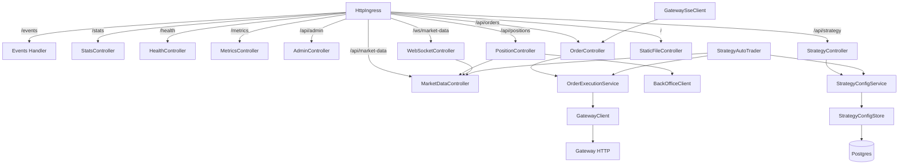

---

## 3. 業務フロー（金融ドメイン視点）

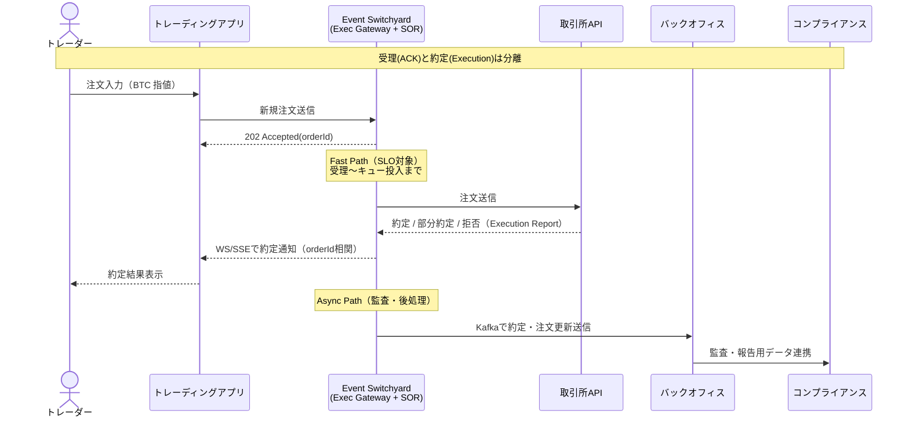

---

## 4. アクター別責務

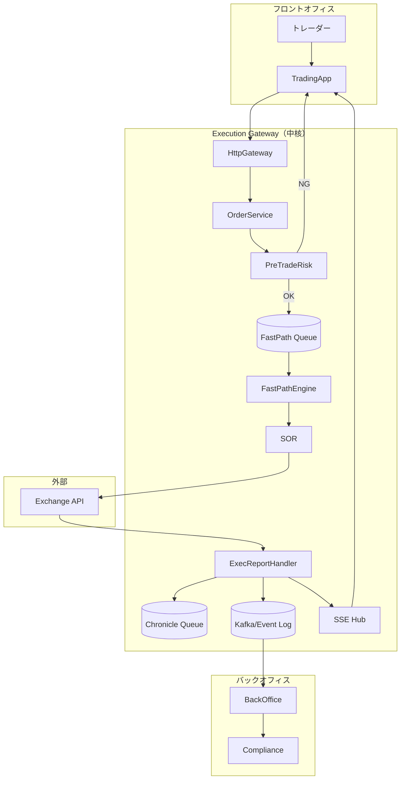

---

## 5. Fast Path 判定ルール（最小）

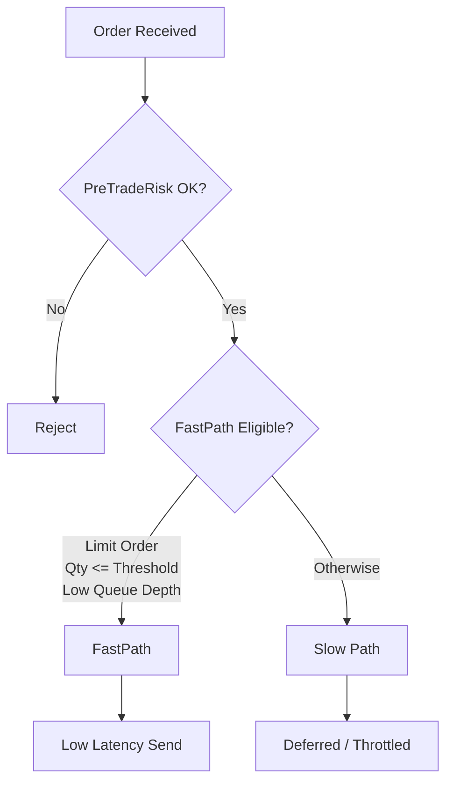

---

## 6. 注文ライフサイクル（状態遷移）

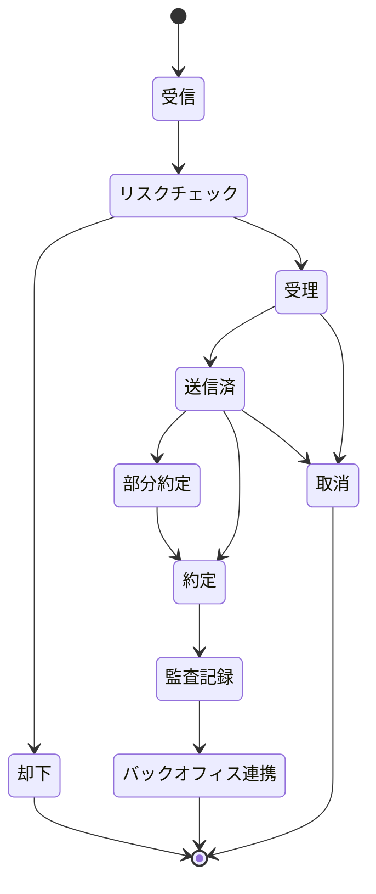

---

## 7. 監査証跡（append-only）と再構成（replay）

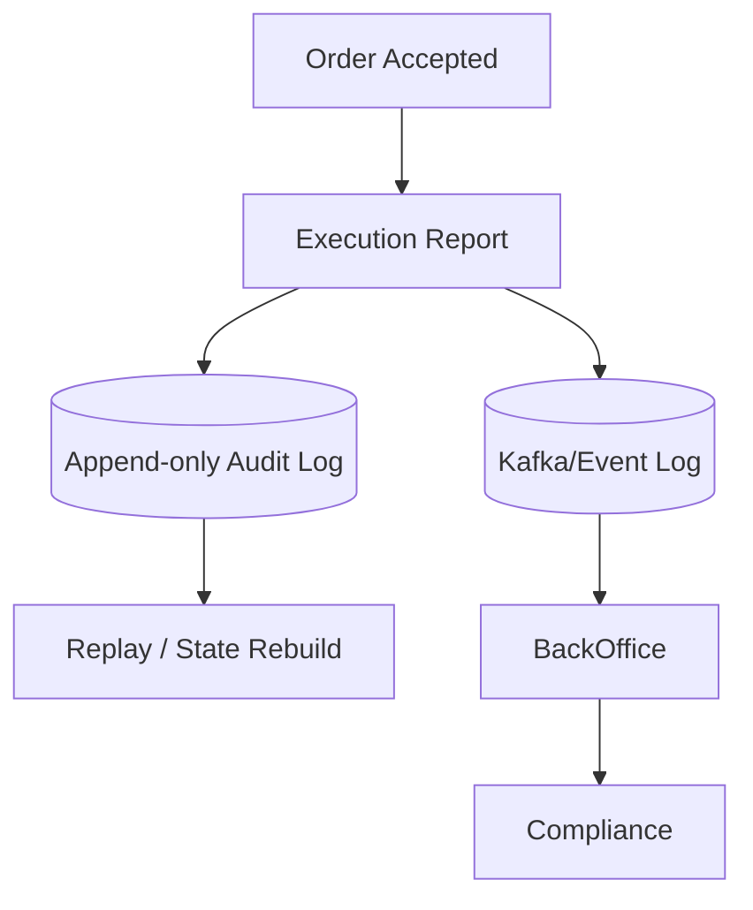

---

## 8. リアルタイムリスク（Pre / Post 分離）

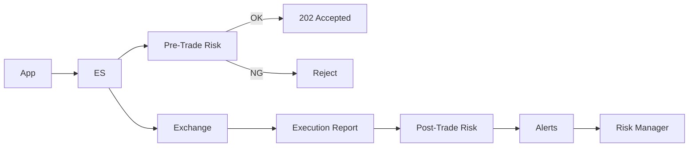

---

## 9. 性能SLO

- **SLO-FAST-001**: `Gateway受信 -> OrderService/Risk -> FastPath Queue投入` の p99
- **SLO-EXEC-001**: `取引所送信 -> Execution Report受信` は外部依存のため別枠（参考値）
- **SLO-ASYN-001**: `Execution Report受信 -> Audit append` の p99（監査の詰まり検知）

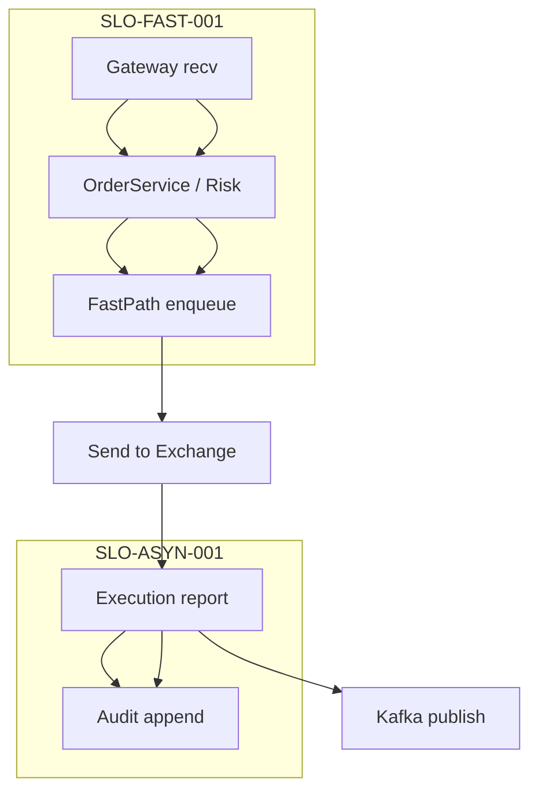

---

## 10. フロント配信のセキュリティ要件

- TLS終端: Nginx/ALBでTLSを終端し、HSTSを有効化する。
- セキュリティヘッダ: CSP、X-Frame-Options、X-Content-Type-Options、Referrer-Policy、Permissions-Policy を明示する。
- 認証/認可: UIはJWT(Bearer)を前提。Cookie利用時は SameSite/HttpOnly/Secure を必須化する。
- 配信分離: バケットは非公開、公開は Nginx/CloudFront のみ。署名URL/Origin Access Control を前提。
- ルーティング: /api と /ws は同一オリジンで中継し、CORS依存を避ける。
- 監視/防御: WAF/Rate Limit/アクセスログの整備。異常検知をアラート化する。
- キャッシュ: index.html は短TTL、assets は長TTL + ハッシュ付きでキャッシュ破棄を明確化する。

## 11. 通しフロー（実装ベースの可視化）

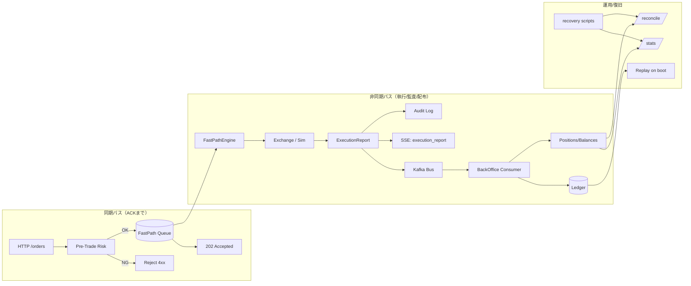

要点
- 同期境界は `ACKまで`。その後は必ず非同期で進む。
- Audit Log が「正（source of truth）」で、BackOffice は Bus を起点に Ledger に積み上げる。
- 復旧は `Replay → Reconcile → PASS/FAIL` の順で正しさを確認する。

## 12. 負荷想定と検証方針（実務目線）

目的別の検証（何を見るか）
- 受理性能（同期境界）: `ACKまでのp99` を守れるか。Fast Path enqueue までを計測。
- 執行遅延（非同期）: `送信→ExecutionReport受信` の分布。外部要因と切り分け。
- BackOffice整合: `replay→reconcile` が PASS すること。正しさが最優先。
- 配信安定性: SSE/Kafka の drop/lag を観測。継続稼働で劣化しないか。

アーキ別の目安（概算の粒度）
- Gateway(ACK): 1k / 10k / 100k orders で p99 と 503 率を見る。
- SSE: 同時接続数（1k/5k/10k）と keepalive で切断率を見る。
- Kafka: publish/sec と lag（1k/5k/10k ev/s）を観測。
- BackOffice: consumer で 1h ソーク（50〜100 ev/s）し、reconcile の一致を確認。

判断（何を切り詰めるか）
- ACK p99 が落ちるなら: 非同期へ逃がす/キュー容量と拒否条件を明確化。
- Kafka lag が膨らむなら: best-effort の範囲を明記、BackOffice を優先復旧。
- reconcile がズレるなら: まず冪等/重複排除と replay の設計を修正。

## 13. インフラ拡張の将来候補

- 状態共有: InMemory を永続ストアへ（RDB/KV/オブジェクト）移行。
- 分散運用: Gateway/BackOffice の水平スケール（K8s/Service/LB）。
- 高速キャッシュ: Redis（セッション・idempotency・短期参照）。
- 観測基盤: Prometheus/Grafana の本番運用とアラート整備。
- DR/バックアップ: スナップショットと復元の自動化。

---

## ソース理解の読む順（短縮版）

1. `app/src/main/kotlin/app/http/HttpIngress.kt`（Appの入口と依存の全体像）
2. `app/src/main/kotlin/app/http/OrderController.kt`（注文の受付→Gateway連携）
3. `gateway/src/main/kotlin/gateway/http/HttpGateway.kt`（Gateway API入口）
4. `gateway/src/main/kotlin/gateway/engine/FastPathEngine.kt`（執行・SSE通知・監査）
5. `backoffice/src/main/kotlin/backoffice/Main.kt`（BackOffice起動・リプレイ）
6. `backoffice/src/main/kotlin/backoffice/kafka/BackOfficeConsumer.kt`（台帳更新の源）
7. `backoffice/src/main/kotlin/backoffice/ledger/FileLedger.kt`（台帳・リプレイ/差分）

---

## Security/Refactor TODO（要整理）

セキュリティ要件（実運用レディの不足分）:
- 認証・認可: JWT/mTLS、アカウント単位の権限分離
- 通信暗号化: HTTPS/TLS終端、セキュリティヘッダ
- CORS/CSRF: Origin制限、CSRFトークン
- レート制限: IP/アカウント単位、リクエストサイズ上限
- 入力検証: 注文パラメータの厳格チェック、許可値の限定
- ネットワーク分離: Gatewayのみ公開、BackOffice/DBは内部
- 秘密情報管理: 秘密鍵/DBパスワードの保護・ローテ
- 監査ログ保全: 改ざん耐性（ハッシュチェーン/署名）
- 監視/アラート: 認証失敗・不正アクセス・異常検知

リファクタ（可読性/運用性）:
- `gateway/src/main/kotlin/gateway/risk/SimplePreTradeRisk.kt` の引数肥大 → RiskConfigで集約
- `gateway/src/main/kotlin/gateway/http/HttpGateway.kt` の依存束ね → GatewayDeps/Builder化
- `gateway/src/main/kotlin/gateway/order/OrderService.kt` の依存束ね → OrderDeps化
- `gateway/src/main/kotlin/gateway/Main.kt` の組み立て責務 → Module/Factory化
- 環境変数パースの分散 → `RiskConfig.fromEnv()` / `StrategyConfigDefaults` で集約

