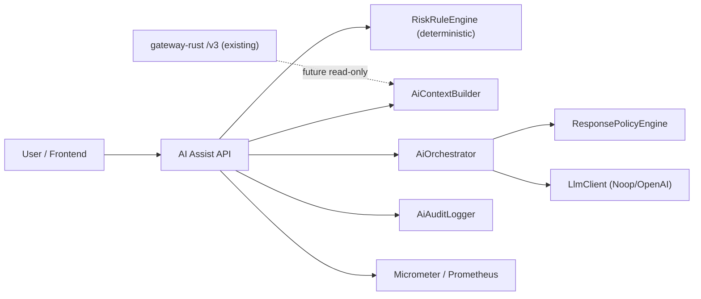
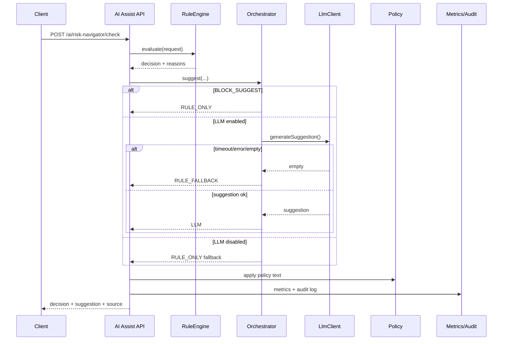

# AI Assist 現行設計 可視化

最終更新: 2026-03-01

## 1. 目的
- hot path (`/v3/orders`) を変更せず、ユーザ向け AI 補助機能を分離導入する。
- 初期対象は `POST /ai/risk-navigator/check`（注文前リスクナビ）。

## 2. 非交渉制約
- `/v3/orders` 同期境界に LLM 呼び出しを入れない。
- AI 障害時でも注文受理/確定動線は継続。
- rule-first（決定論ルール先行）を維持。

## 3. 全体構成

## 4. リクエストフロー

## 5. API 契約（現行）
- `POST /ai/risk-navigator/check`
  - request:
    - `accountId`, `symbol`, `side`, `qty`, `price`, `context`
  - response:
    - `decision` (`OK | WARN | BLOCK_SUGGEST`)
    - `reasons`
    - `suggestion`
    - `suggestionSource` (`RULE_ONLY | RULE_FALLBACK | LLM`)
    - `llmUsed`, `fallbackUsed`, `fallbackReason`, `processingMs`

## 6. provider 切替
- `ai.assist.llm.provider=none` -> `NoopLlmClient`
- `ai.assist.llm.provider=openai` -> `OpenAiLlmClient`
- `AI_ASSIST_LLM_ENABLED` が `false` の場合は provider に関わらず rule fallback

## 7. メトリクス
- `ai_assist_risk_check_total{decision,source}`
- `ai_assist_risk_fallback_total{reason}`
- `ai_assist_risk_check_latency`

補助メトリクス取得:
- `/actuator/prometheus`

## 8. ゲート
- Probe:
  - `scripts/ops/run_ai_assist_probe.sh`
- Single gate:
  - `scripts/ops/check_ai_assist_gate.sh`
  - 判定: `p95`, `error_rate`（fallback gateは任意）
- A/B gate:
  - `scripts/ops/check_ai_assist_ab_gate.sh`
  - A: `rule-only`
  - B: `llm併用`
  - 判定: A/B error_rate, B p95, p95 delta, 任意で fallback/llm_used 率

## 9. 現状の制約
- OpenAI 実装は追加済みだが、API キー未設定時は fallback 動作。
- v3 の実メトリクス/約定データを使った context grounding は未接続。
- 投資助言境界は `ResponsePolicyEngine` の最小実装のみ（強化余地あり）。

## 10. 次段
1. OpenAI 実接続下で `ENFORCE_LLM_USED_GATE=1` の通過実測を取得。
2. context builder に v3 read-only 連携（order status + metrics snapshot）を追加。
3. policy をルール化（禁止表現、推奨文の必須注記、監査項目拡張）。

