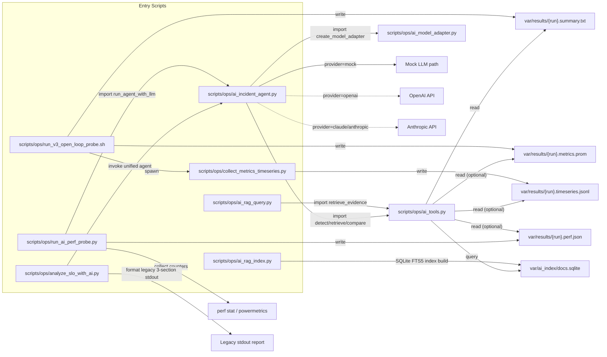
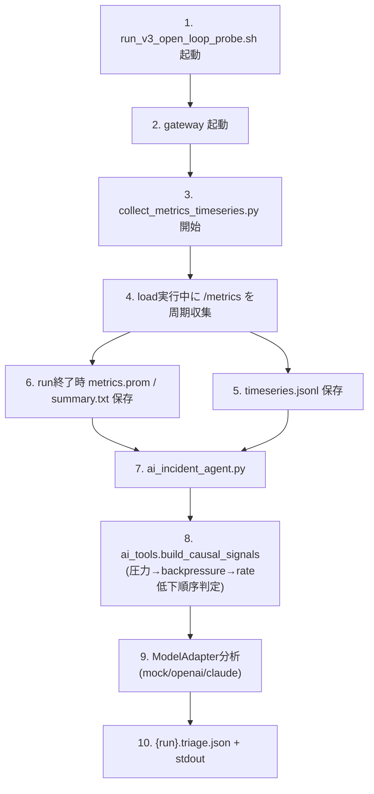
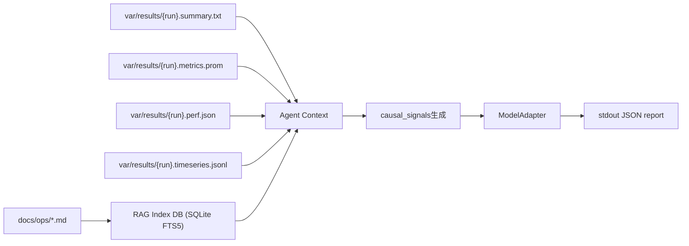

# AI実装 構造マップ（時系列/因果判定対応）

最終更新: 2026-03-14

## 1. ソース依存関係（モジュール間）

## 2. 処理順序（時系列 + 因果判定）

## 3. 責務分離

| ファイル | 役割 | 外部API依存 |
|---|---|---|
| `ai_rag_index.py` | `docs/ops/*.md` + `summary/metrics/perf` のチャンク化とSQLite索引構築 | なし |
| `ai_rag_query.py` | 索引への検索確認CLI | なし |
| `ai_tools.py` | SLO判定、run入力/時系列/perf読込、RAG検索、因果シグナル生成 | なし |
| `ai_model_adapter.py` | `ModelAdapter`抽象 + `MockModelAdapter/OpenAIAdapter/AnthropicAdapter` | OpenAI/Claude利用時のみあり |
| `ai_incident_agent.py` | Detect→Retrieve→Analyze→Reportのオーケストレーション | OpenAI/Claude利用時のみあり |
| `run_ai_perf_probe.py` | 負荷実行 + CPUカウンタ収集 + perf JSON生成 + triage連携 | OpenAI/Claude利用時のみあり |
| `collect_metrics_timeseries.py` | `/metrics` の周期サンプリング（JSONL時系列保存） | なし |
| `analyze_slo_with_ai.py` | legacy CLI互換ラッパー（内部は `ai_incident_agent.py` を呼び出し） | OpenAI/Claude利用時のみあり |

## 4. データ境界

## 5. 現在のモード

- `mock` が既定（API疎通なし）
- `--provider openai` で OpenAI API 呼び出しに切替
- `--provider claude`（または `anthropic`）で Claude API 呼び出しに切替
- モデル既定: `gpt-5-nano`（openai）/ `claude-sonnet-4-20250514`（claude）
- 主因判定ヒント: `causal_signals.timeline.order` を出力
