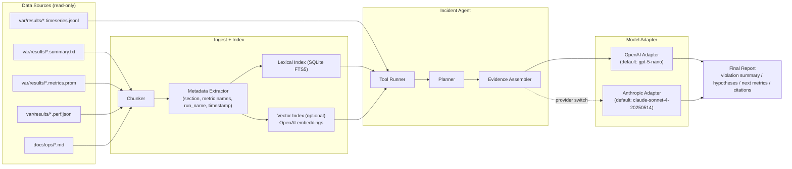
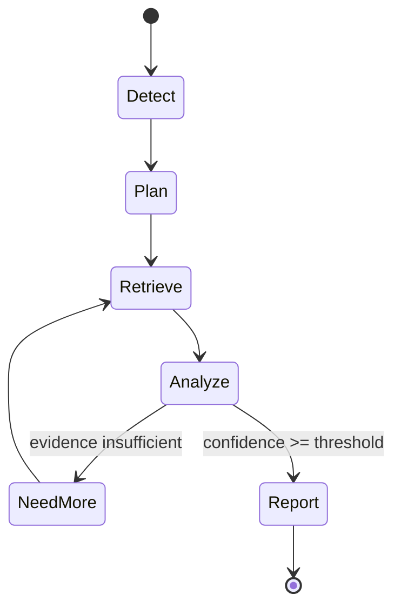

# SLO違反トリアージ向け RAG + Agent 設計

最終更新: 2026-03-14
対象題材: `SLO違反インシデント・トリアージCopilot`

## 0. 目的

現状の単発LLM分析（`summary + 固定Section抜粋`）を、次の2点で拡張する。

1. RAG: 参照範囲を `docs/ops` 全体 + 直近run履歴へ広げ、根拠引用を安定化  
2. Agent: 複数ステップ（比較・追加入手・再評価）で一次切り分けの精度を上げる

前提制約:
- `/v3/orders` hot path 非介入
- read-only 解析
- 失敗時は既存運用（手動調査 or deterministic fallback）に即時フォールバック

## 1. なぜこの題材が「ちょうど良い」か

- 入力データが既にある（`summary.txt`, `metrics.prom`, `perf.json`, `timeseries.jsonl`, `docs/ops/*.md`）
- 成果が測りやすい（MTTA, 初動正答率, 再現性）
- 誤作動時の影響が限定的（助言系で、執行ロジックに非介入）
- RAG/Agentの差分価値が明確（「どの根拠でそう言ったか」を強化できる）

## 2. 全体アーキテクチャ



## 3. RAG設計

## 3.1 インデクシング対象

1. `docs/ops/current_design_visualization.md`（高優先）  
2. `docs/ops/contract_draft.md`, `durable_path_design.md`, `phase_progress.md`  
3. `var/results/*/*.summary.txt` と `var/results/*.summary.txt`  
4. `var/results/*/*.metrics.prom` と `var/results/*.metrics.prom`（全文ではなく重要行抽出）
5. `var/results/*/*.perf.json` と `var/results/*.perf.json`（counter/derived/delta を抽出）
6. `var/results/*/*.timeseries.jsonl` と `var/results/*.timeseries.jsonl`（Agentが直接読み込み、因果順序判定に使用）

## 3.2 チャンク戦略

- Markdown:
  - 見出し単位 (`##` / `###`) で分割
  - 1チャンク目安: 400〜1000 tokens
  - `section_id`, `heading`, `source_path`, `updated_at` をメタデータ付与
- summary:
  - 1ファイル1チャンク + 主要SLOキーをメタ化
- metrics.prom:
  - 重要メトリクスのみ抽出して1チャンク化
  - ラベル付き系列は `metric_name{...}` を normalize して格納
- perf.json:
  - 1ファイル1チャンク
  - `counter_mode`, `collection_ok`, `counters.*`, `derived.*`, `delta_vs_baseline.*` を格納
- timeseries.jsonl:
  - FTS indexには載せず、Agent実行時に直接ロード
  - `pressure -> backpressure -> accepted_rate drop` の時系列順序を抽出

## 3.3 索引方式（推奨: ハイブリッド）

- Stage A: ルールフィルタ
  - 例: `ack_accepted_p99` 違反なら ACK/accepted/backpressure関係を優先
- Stage B: Lexical検索
  - SQLite FTS5でBM25相当検索（依存少、速い）
- Stage C: Vector検索（任意）
  - `text-embedding-3-small` で埋め込み検索
- Stage D: 再ランク
  - `score = 0.5*lexical + 0.3*vector + 0.2*rule_prior`

## 3.4 引用ルール（必須）

- 最終回答の各主張に最低1件の `source_path + chunk_id` を紐付け
- 根拠不足の主張は禁止（`unknown` を返す）
- 出力に `citations` 配列を含める

## 4. Agent設計

## 4.1 Agentの責務

- 目的: 「一次切り分け」を5分以内に再現可能にする
- 非目的: 自動修復、設定変更の自動適用、プロセス再起動

## 4.2 ツール定義（最小）

1. `get_run_summary(run_name)`  
2. `get_run_metrics(run_name, metric_names[])`  
3. `retrieve_evidence(query, top_k, filters)`  
4. `compare_recent_runs(metric_names[], window)`  
5. `list_related_runs(pattern, limit)`
6. `get_run_timeseries(run_name)`  
7. `build_causal_signals(summary, metrics, timeseries, perf)`

すべて read-only。

## 4.3 状態遷移



## 4.4 停止条件 / 予算制限

- `max_steps = 4`
- `max_retrieval_calls = 6`
- `max_context_tokens = 16k`
- `timeout_sec = 90`
- いずれか超過時は `partial report + unknown markers`

## 4.5 失敗時フォールバック

1. Agent失敗 -> deterministic report（SLO違反一覧 + 推奨メトリクス固定リスト）  
2. LLM失敗 -> deterministic report（SLO違反一覧 + 推奨メトリクス固定リスト）  
3. Index不整合 -> lexicalのみで継続

## 5. モデル/ベンダ抽象化（OpenAI→Claude切替）

`ModelAdapter` インターフェースを固定し、Agent本体から分離する。

```text
interface ModelAdapter:
  generate_analysis(context_json) -> AnalysisResult
  generate_retrieval_query(state_json) -> QueryPlan
```

実装:
- `OpenAIAdapter`（既定: `gpt-5-nano`）
- `AnthropicAdapter`（既定: `claude-sonnet-4-20250514`）

切替は `--provider` と `--model` のCLI設定のみで実施し、  
RAG/Agentロジックは不変とする。

## 6. データスキーマ（最小）

## 6.1 Retrieval Document

```json
{
  "doc_id": "docs/ops/current_design_visualization.md#sec9-03",
  "source_path": "docs/ops/current_design_visualization.md",
  "chunk_id": "sec9-03",
  "text": "...",
  "metadata": {
    "type": "ops_doc",
    "section": "9",
    "heading": "計測と運用ゲート",
    "updated_at": "2026-03-08"
  }
}
```

## 6.2 Agent Report

```json
{
  "run_name": "v3_open_loop_20260308_171852",
  "violations": [
    {"name": "accepted_rate", "observed": 0.9842, "rule": ">=0.99", "deviation_pct": 0.58}
  ],
  "hypotheses": [
    {"text": "durable pressure rise", "confidence": 0.71, "citations": ["doc_id_1", "doc_id_2"]}
  ],
  "recommended_metrics": [
    "gateway_v3_durable_queue_utilization_pct_max",
    "gateway_v3_durable_backlog_growth_per_sec"
  ],
  "next_actions": [
    "compare last 5 strict-gate runs",
    "check confirm p99 trend"
  ],
  "unknowns": []
}
```

## 7. 実装配置（現時点）

```text
scripts/ops/
  ai_rag_index.py            # 実装済み: index build/update (SQLite FTS5)
  ai_rag_query.py            # 実装済み: retrieval debug CLI
  ai_incident_agent.py       # 実装済み: orchestrator (mock/openai/claude)
  ai_model_adapter.py        # 実装済み: ModelAdapter + Mock/OpenAI/Anthropic
  ai_tools.py                # 実装済み: file/query + causal signal utilities (read-only)
  run_ai_perf_probe.py       # 実装済み: probe実行 + perf収集 + triage連携 (mock/openai/claude)
  analyze_slo_with_ai.py     # 実装済み: legacy CLIラッパー（内部はAgent経路）
  collect_metrics_timeseries.py  # 実装済み: run中の /metrics 周期サンプリング
var/ai_index/
  docs.sqlite                # 実行時生成: FTS + metadata
  vectors.jsonl              # optional embeddings
docs/ops/
  ai_rag_agent_triage_design.md
```

## 8. KPIと受入基準

## 8.1 運用KPI

- `mtta_minutes`（平均初動時間）: 30%以上短縮
- `first_hypothesis_hit_rate`: 70%以上
- `grounded_answer_ratio`: 99%以上
- `unknown_when_evidence_missing`: 100%

## 8.2 品質ゲート

- 誤引用率: 0
- 引用なし主張率: 0
- P95 応答時間:
  - RAG only: <= 2s（ローカル索引）
  - Agent: <= 12s（LLM込み）

## 9. 段階導入

1. Phase A（MVP, 3-5日）
- Lexical RAG + 単発要約
- 引用付きJSON出力

2. Phase B（1週）
- Agent導入（`compare_recent_runs` と `retrieve_evidence`）
- 反復2-4ステップ

3. Phase C（1週）
- Vector検索追加
- オフライン評価データで再現性検証

4. Phase D（任意）
- OpenAI vs Claude のA/B比較運用
- コスト/品質/応答時間の継続最適化

## 10. 既存実装との関係

- `scripts/ops/analyze_slo_with_ai.py` は legacy CLI名を維持した互換ラッパー
- 内部実装は `ai_incident_agent.py` を直接呼び出す（Agent一本化）
- fallbackは単発経路ではなく deterministic report に統一

## 11. 実装開始時の最小タスク

1. `ai_rag_index.py` で `docs/ops/current_design_visualization.md` のセクション索引を作る
2. `ai_rag_query.py` で `accepted_rate` クエリの top-k を可視化する
3. `ai_incident_agent.py` で `Detect -> Retrieve -> Analyze -> Report` の1ループを実装する
4. `analyze_slo_with_ai.py` を Agent呼び出しラッパーに置換して入口を一本化する

## 12. 実務化ロードマップ（2026-03-14 追記）

### 12.1 現状評価（scaffolding → 実務化）

| 項目 | 設計 | 実装 | Gap |
|---|---|---|---|
| LLM接続 | OpenAI/Claude切替可能 | OpenAIAdapter + AnthropicAdapter 実装済み | なし |
| Agent反復 | Analyze→NeedMore→Retrieve ループ | 1直線（ループなし） | **根拠不足時の再検索がない** |
| インデクス範囲 | docs/ops + var/results | docs/ops/*.md のみ | **過去run結果がRAGで引けない** |
| 索引方式 | ハイブリッド4段 | FTS5 BM25のみ | Vector/再ランク未実装（後回し可） |
| 品質評価 | KPI定義あり | 計測の仕組みなし | **精度を数字で示せない** |
| フォールバック | 3段設計 | mockが常に成功 | **障害時の動作が未検証** |

### 12.2 実装ステップ（優先順）

#### Step 1: LLM接続（OpenAI/Claude）

`ai_model_adapter.py` に `OpenAIAdapter` / `AnthropicAdapter` を実装。

- provider切替は `--provider openai|claude`（`anthropic` も同義）
- JSON出力契約を system prompt 側で固定
- `--provider openai --model gpt-5-nano` / `--provider claude --model claude-sonnet-4-20250514`

環境変数:
- `OPENAI_API_KEY`: OpenAI 利用時
- `ANTHROPIC_API_KEY`: Claude 利用時

#### Step 2: Agent反復ループ

`ai_incident_agent.py` の `run_agent` を反復構造に変更。

```
for step in range(MAX_STEPS):
    evidence += retrieve(queries)
    analysis = adapter.generate_analysis(context)
    if analysis.confidence >= threshold or not analysis.unknowns:
        break
    queries = analysis.unknowns  # LLMが返した追加検索クエリ
```

停止条件（設計書4.4を実装）:
- `max_steps = 4`
- `max_retrieval_calls = 6`（累積）
- `timeout_sec = 90`
- いずれか超過時は `partial report + unknown markers`

#### Step 3: summary/metrics インデクス拡張

`ai_rag_index.py` に `var/results/` のインデクシングを追加。

- `*.summary.txt`: 1ファイル1チャンク（key=value をそのまま格納）
- `*.metrics.prom`: 重要メトリクスのみ抽出して1チャンク化
- `*.perf.json`: counter/derived/delta を抽出して1チャンク化
- `*.timeseries.jsonl`: Agentで直接ロード（index未登録）
- メタデータ: `type=run_result`, `run_name`, `mtime`

#### Step 4: 評価フレームワーク

`scripts/ops/ai_eval.py` を新設。

- `var/ai_eval/case_*.json` に既知のSLO違反 + 期待する仮説を定義
- 各caseを実行し、KPI（設計書8.1）を自動計測:
  - `first_hypothesis_hit_rate`: 目標 >= 70%
  - `grounded_answer_ratio`: 目標 >= 99%
  - `response_time_p95`: 目標 <= 12s
- 結果を `var/ai_eval/results.json` に出力

#### Step 5: フォールバック実装

`ai_incident_agent.py` に3段フォールバックを実装。

```
try:
    report = run_agent_with_llm(args)        # Agent + LLM
except (AgentError, TimeoutError, LLMError):
    report = run_deterministic(args)          # SLO違反一覧 + 固定リスト
```

### 12.3 やらないもの（現時点）

| 項目 | 理由 |
|---|---|
| Vector検索 (Stage C) | FTS5で実用上十分。embedding API依存とコストを増やす価値が薄い |
| 追加ベンダ統合（Claude以外） | 現状 OpenAI/Claude で運用要件を満たしており、優先度が低い |
| 再ランク (Stage D) | BM25 + ルールフィルタで実用上十分 |
| 自動修復 / 設定変更適用 | 設計書4.1で明示的に非目的としている |

### 12.4 実装後の配置

```text
scripts/ops/
  ai_rag_index.py            # 更新: summary/metrics/perf インデクス追加
  ai_rag_query.py            # 変更なし
  ai_incident_agent.py       # 更新: Agent反復ループ + フォールバック + causal_signals
  ai_model_adapter.py        # 更新: OpenAIAdapter/AnthropicAdapter + causal_signals prompt投入
  ai_tools.py                # 更新: causal_signals / timeseries loader
  run_ai_perf_probe.py       # 新規: probe + counter収集 + triage連携
  collect_metrics_timeseries.py  # 新規: run中時系列収集
  ai_eval.py                 # 新規: 評価フレームワーク
var/ai_index/
  docs.sqlite                # 更新: summary/metrics/perf チャンク追加
var/ai_eval/
  case_001_ack_violation.json
  case_002_accepted_rate_drop.json
  case_003_loss_suspect.json
  results.json               # 実行時生成
```

## 13. Gate → Triage 自動パイプライン（2026-03-14 追記）

### 13.1 位置づけ

Section 12 で実装した Agent + RAG + 評価フレームワークを、
既存の Gate スクリプトに **自動接続** した。
これにより「退行検知（Gate）+ 原因自動評価（Triage）」が
一つのパイプラインとして動作する。

```
コード変更 / パラメータ調整
  ↓
負荷試験実行 (run_v3_open_loop_probe.sh)
  ↓
時系列収集 (collect_metrics_timeseries.py)
  - var/results/<run>.timeseries.jsonl
  ↓
Strict Gate 判定
  ACK p99 ≤ 40μs? accepted_rate ≥ 0.99? LOSS_SUSPECT = 0?
  ↓ PASS → exit 0
  ↓ FAIL
AI Triage 自動実行 (ai_incident_agent.py)
  ↓
causal_signals 生成
  - pressure -> backpressure -> rate_drop 順序判定
  ↓
.triage.json 出力 → [artifacts] triage=path
  ↓
exit 1
```

### 13.2 変更箇所

| ファイル | 変更内容 |
|---|---|
| `scripts/ops/run_v3_open_loop_probe.sh` | run中に時系列サンプリング（`*.timeseries.jsonl`）を収集。Gate FAIL 時は `ai_incident_agent.py` を自動呼び出し |
| `scripts/ops/collect_metrics_timeseries.py` | `/metrics` を周期サンプリングして JSONL 出力 |
| `scripts/ops/ai_tools.py` | `build_causal_signals()` を追加し、時系列順序から主因ヒントを算出 |
| `scripts/ops/check_v3_local_strict_gate.sh` | loop wrapper の最終 FAIL 時に、生成された `.triage.json` の一覧を表示 |

### 13.3 制御

| 環境変数 | デフォルト | 説明 |
|---|---|---|
| `AI_TRIAGE_PROVIDER` | `mock` | `mock` / `openai` / `claude`（`anthropic` も可） |
| `OPENAI_API_KEY` | (なし) | `openai` 時に必要 |
| `ANTHROPIC_API_KEY` | (なし) | `claude` / `anthropic` 時に必要 |
| `ENABLE_TIMESERIES` | `1` | `run_v3_open_loop_probe.sh` で時系列収集を有効化 |
| `TIMESERIES_INTERVAL_MS` | `500` | `/metrics` サンプル間隔（ms） |
| `TIMESERIES_METRICS` | 主要root-cause群 | 収集対象メトリクスをカンマ区切りで指定 |

Triage 実行は `|| true` でガードされており、Agent 障害時も Gate の exit code に影響しない。

### 13.4 Copilot Chat との差別化

| 観点 | Copilot Chat | AI Triage Agent |
|---|---|---|
| 起動方式 | 人間が質問する（Pull） | Gate 失敗で自動実行（Push） |
| 利用可能場所 | エディタ内 | CI/CD、PagerDuty、Grafana annotation |
| 出力形式 | 自然言語テキスト | 構造化 JSON（機械可読） |
| 過去ラン比較 | 手動で開く | 自動で直近 N 件を参照 |
| オンコール対応 | エディタを開いて質問 | アラートに分析が添付済み |

核心: **Push × 構造化 × 運用動線統合**。
Gate 失敗時に、人が聞く前にレポートが生成され、
`.triage.json` として CI artifact / Slack / Grafana annotation に流せる形で出力される。

### 13.5 残課題

| 順 | 項目 | 状態 | 備考 |
|---|---|---|---|
| 1 | Gate → Triage 自動接続 | **完了** | `run_v3_open_loop_probe.sh` に 10 行追加 |
| 2 | 時系列収集 + 因果順序判定 | **完了** | `timeseries.jsonl` + `causal_signals.timeline.order` |
| 3 | LLM 実接続テスト | **完了** | `openai` / `claude` の両providerで疎通確認済み |
| 4 | 出力アダプタ | 未着手 | Slack webhook / Grafana annotation API / CI artifact |
