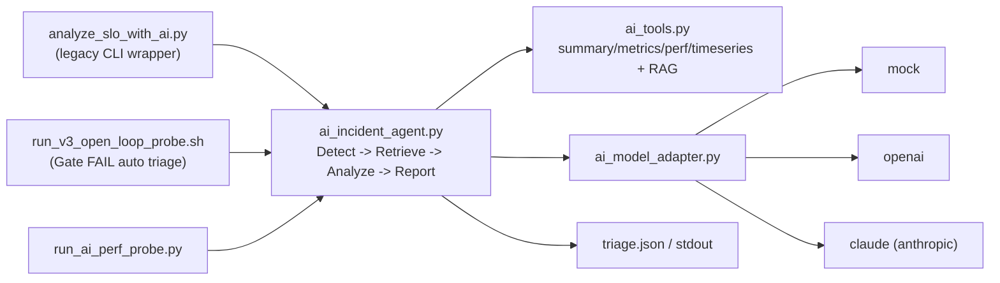

# SLO違反AI分析 実装メモ（Agent一本化 / OpenAI+Claude対応）

最終更新: 2026-03-14

## 1. 実装方針（現在）

- 解析ロジックは `ai_incident_agent.py` に一本化
- `analyze_slo_with_ai.py` は legacy CLI名を維持したラッパー
  - 内部で `run_agent_with_llm()` を呼び出す
  - stdout は従来互換（Violation Summary / LLM Analysis / Recommended Metrics）
- provider は `mock` / `openai` / `claude`（`anthropic` も同義）をサポート

## 2. どこに実装したか

- Agent本体: `scripts/ops/ai_incident_agent.py`
- Provider抽象: `scripts/ops/ai_model_adapter.py`
  - `MockModelAdapter`
  - `OpenAIAdapter`
  - `AnthropicAdapter`（Claude）
- 互換CLIラッパー: `scripts/ops/analyze_slo_with_ai.py`
- 負荷+AI統合実行: `scripts/ops/run_ai_perf_probe.py`

依存:
- `openai>=1.0.0`
- `anthropic>=0.34.0`

## 3. アーキテクチャ



## 4. Provider挙動

| provider | 実際のアダプタ | 既定モデル | 必須環境変数 |
|---|---|---|---|
| `mock` | `MockModelAdapter` | `mock-triage-v1` | なし |
| `openai` | `OpenAIAdapter` | `gpt-5-nano` | `OPENAI_API_KEY` |
| `claude` / `anthropic` | `AnthropicAdapter` | `claude-sonnet-4-20250514` | `ANTHROPIC_API_KEY` |

失敗時:
- LLM/API失敗時は deterministic report にフォールバック
- Gateway hot path には非介入（opsスクリプトのみ）

## 5. 実行方法

```bash
# 1) 互換CLI（Agent経路）
python3 scripts/ops/analyze_slo_with_ai.py \
  --run-name <RUN_NAME> \
  --provider mock
```

```bash
# 2) OpenAI
export OPENAI_API_KEY=...your_key...
python3 scripts/ops/analyze_slo_with_ai.py \
  --run-name <RUN_NAME> \
  --provider openai \
  --model gpt-5-nano
```

```bash
# 3) Claude
export ANTHROPIC_API_KEY=...your_key...
python3 scripts/ops/analyze_slo_with_ai.py \
  --run-name <RUN_NAME> \
  --provider claude \
  --model claude-sonnet-4-20250514
```

```bash
# 4) dry-run（LLM呼び出しなし）
python3 scripts/ops/analyze_slo_with_ai.py \
  --run-name <RUN_NAME> \
  --dry-run
```

## 6. 最新拡張（Agent入力）

- `summary + metrics + perf + timeseries` を入力として使用
- `build_causal_signals()` により時系列因果ヒントを生成
  - `causal_signals.timeline.order`
  - `causal_signals.timeline.order_consistent`

関連資料:
- `docs/ops/ai_impl_structure_map.md`
- `docs/ops/ai_rag_agent_triage_design.md`
