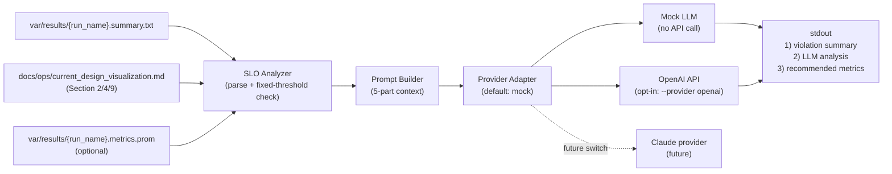

# SLO違反AI分析 実装メモ（mock default / OpenAI opt-in）

最終更新: 2026-03-13

## 1. どこに実装したか

- メイン実装:
  - `scripts/ops/analyze_slo_with_ai.py`
- 依存追加:
  - `requirements.txt` に `openai>=1.0.0` を追加

## 2. アーキテクチャ



## 3. どう実装したか（要件マッピング）

| 要件 | 実装箇所 | 実装内容 |
|---|---|---|
| 入力（必須）`summary.txt` | `main()` | `--run-name` から `var/results/{run_name}.summary.txt` を解決して必須チェック |
| 入力（必須）`current_design_visualization.md` | `main()` | `--design-doc`（既定 `docs/ops/current_design_visualization.md`）を必須チェック |
| 入力（任意）`metrics.prom` | `main()` + `parse_prom_file()` | 存在時のみ読み込み。未存在でも処理継続 |
| 固定SLO閾値 | `SLO_RULES` | `ack_accepted_p99<=40`, `accepted_rate>=0.99`, `completed_rps>=10000`, `loss_suspect_total==0`, `rejected_killed==0` を固定定義 |
| 乖離幅計算 | `deviation_pct()` / `format_deviation()` | ルール別に乖離率を計算。閾値0系は `n/a` 表示 |
| LLMコンテキスト構造 | `build_prompt()` | 1)SLO定義 2)計測値 3)違反と乖離 4)設計Section2/4/9 5)質問文 を1つのプロンプトに整形 |
| 設計Doc Section 2/4/9優先 | `extract_markdown_sections()` | `## 2.`, `## 4.`, `## 9.` を抽出してプロンプトへ埋め込み |
| 出力フォーマット（stdout） | `print_stdout_output()` | 1) Violation Summary 2) LLM Analysis 3) Recommended Metrics を固定順で出力 |
| モデル指定 | CLI引数 `--model` | 既定は `mock-triage` 相当。OpenAI利用時に `gpt-5-nano` 等を指定可能 |
| LLM連携（デフォルト） | `call_mock_once()` | API呼び出しなしで決定論的JSONを返す |
| API呼び出し1回（opt-in） | `call_openai_once()` | `--provider openai` 指定時のみ `responses.create(...)` を1回呼び出し |
| ストリーミング不要 | `call_openai_once()` | 非ストリーミングの同期呼び出しのみ |
| APIキー環境変数（opt-in） | `call_openai_once()` | `OPENAI_API_KEY` を必須で読み取り |
| hot path非介入 | 配置設計 | `scripts/ops` のオフライン解析スクリプトとして実装。Gateway本体コードは未変更 |

## 4. 実行方法

```bash
# dry-run（APIを呼ばず出力確認）
scripts/ops/analyze_slo_with_ai.py \
  --run-name v3_open_loop_20260312_215143 \
  --dry-run
```

```bash
# 実行（デフォルト: モック、API呼び出しなし）
scripts/ops/analyze_slo_with_ai.py \
  --run-name v3_open_loop_20260312_215143 \
  --provider mock
```

```bash
# 実行（OpenAI APIを1回呼ぶ: opt-in）
export OPENAI_API_KEY=...your_key...
scripts/ops/analyze_slo_with_ai.py \
  --run-name v3_open_loop_20260312_215143 \
  --provider openai \
  --model gpt-5-nano
```

## 5. Claudeへ将来切り替えるとき

現状は `--provider openai` のみ実装済み。`--provider claude` は予約済み分岐。

切替時の変更点は以下に限定される想定:

1. `call_openai_once()` と同じ入出力契約の `call_claude_once()` を追加  
2. `main()` の provider 分岐で `claude` を有効化  
3. 既存の SLO判定・データ抽出・プロンプト構造・stdout出力はそのまま再利用

この分離により、モデル/ベンダ変更時も運用ロジック（SLO評価と文脈構造）を不変にできる。
