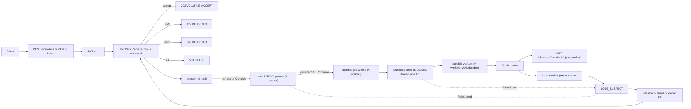
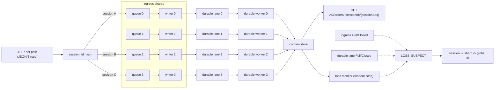
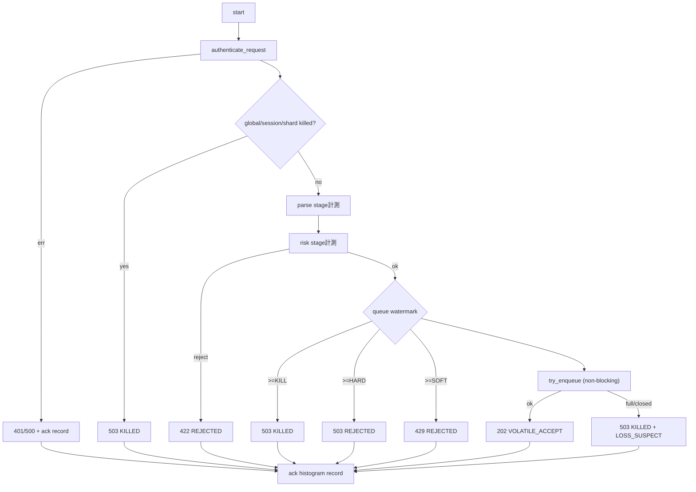
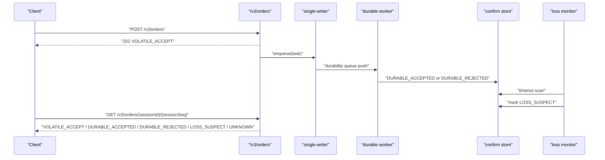
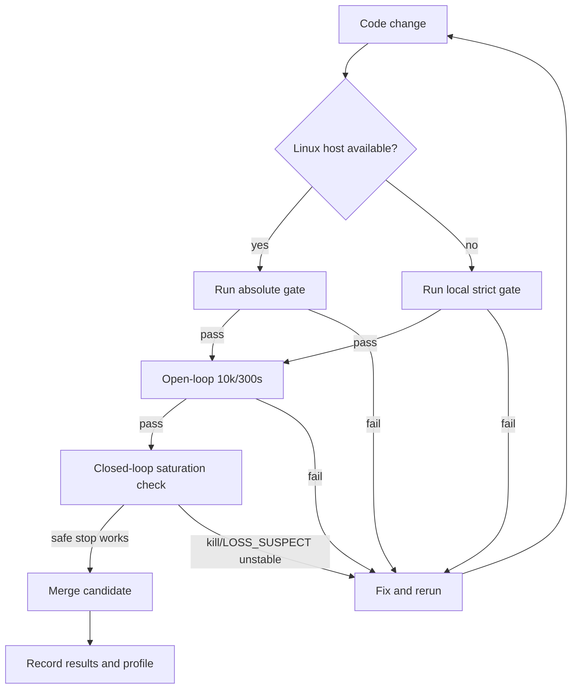

# Pure HFT v3 現行設計 可視化（個人開発・実務本番向け）

最終更新: 2026-03-08

## 0. 正本の位置づけ
- 本書は Pure HFT v3 現行構成の可視化正本とする。
- 契約正本は `docs/ops/contract_draft.md`。
- durable経路正本は `docs/ops/durable_path_design.md` と `docs/ops/durable_path_visualization.md`。
- 進捗正本は `docs/ops/phase_progress.md`。
- 旧資料は `docs/ops/old/` を参照する。

## 1. 目的
- `/v3/orders` の現行実装を「契約ゲート」「同期境界」「停止制御」で可視化する。
- 個人開発で再現可能な実務本番レベル（Linux単機）に限定して、運用判断を固定する。

### 1.1 Kafka/Bus の位置づけ（2026-03-05）
- `/v3/orders` の hot path（`parse -> risk -> enqueue -> 202`）は Kafka 非依存。
- Kafka は backoffice / integration 用の別経路で、性能判定対象の同期境界に入れない。
- ビルド既定は `kafka-bus` feature OFF（Kafka依存なし）。
- Kafka連携が必要な場合のみ `--features kafka-bus` で有効化し、実行時に `KAFKA_ENABLE=1` を設定する。
- `kafka-bus` feature なしで `KAFKA_ENABLE=1` の場合は warning を出し、bus は無効のまま動作する。

## 2. Pure絶対ゲート（固定）
| 項目 | 判定値 | データソース |
|---|---:|---|
| live ack p99 | `gateway_live_ack_p99_us <= 200` | `/metrics` |
| Throughput | `Requests/sec >= 10_000` を `300s` 継続 | `wrk` |
| 受理率 | `gateway_v3_accepted_rate >= 0.95` | `/metrics` |
| 実行環境 | Linuxのみ契約判定 | `uname` |

- 契約判定スクリプト: `scripts/ops/check_v3_absolute_gate.sh`
- 未達は Fail（非0終了）とし、マージ不可。

### 2.1 Linux未確保期間の暫定 strict gate（厳格化）
| 項目 | 判定値 | データソース |
|---|---:|---|
| live ack p99 | `gateway_live_ack_p99_us <= 100` | `/metrics` |
| Throughput | `completed_rps >= 10_000` を `300s` | open-loop |
| 受理率 | `gateway_v3_accepted_rate >= 0.99` | `/metrics` |
| killed rejects | `gateway_v3_rejected_killed_total == 0` | `/metrics` |
| loss suspect | `gateway_v3_loss_suspect_total == 0` | `/metrics` |

- 実行スクリプト: `scripts/ops/check_v3_local_strict_gate.sh`
- 役割: absolute gate の代替ではなく、Linux未確保期間の劣化防止。

### 2.2 実運用SLO（性能目標, 2026-02-28更新）
`200us` は absolute gate の合否天井。実運用の性能目標は別に固定する。

| 項目 | SLO | Source |
|---|---:|---|
| accepted-only ACK p99 | `gateway_live_ack_accepted_p99_us <= 40` | `/metrics` |
| 受理率 | `gateway_v3_accepted_rate >= 0.95` | `/metrics` |
| 常用帯（安全側） | `accepted_rps ~= 42,000/s` | wrk閉ループ実測 |
| 95%受理の投入境界 | `~45,000 req/s` | wrk閉ループ実測 |

実行:
- 安定ゲート（open-loop 10k/300s）: `scripts/ops/check_v3_stable_gate.sh`
- 能力ゲート（open-loop 45k/120s）: `scripts/ops/check_v3_capability_gate.sh`
- 飽和診断（closed-loop, stress専用）: `scripts/ops/run_v3_phase2_compare.sh`

根拠:
- `var/results/v3_phase2_compare_20260223_232919.summary.txt`
  - `rps_med=42225.4`, `accept_ratio_med=1.000000`, `ack_accepted_p99_med=10us`
- `var/results/v3_phase2_compare_20260223_233409.summary.txt`
  - `rps_med=58154.6`, `accept_ratio_med=0.733794`, `accepted_rps_med=42726.3`, `ack_accepted_p99_med=20us`
- `accepted_rps` 実効上限を約 `42.7k/s` とみなし、`accepted_rate>=0.95` の投入境界は
  - `42.7k / 0.95 ~= 44.9k req/s`（約 `45k req/s`）
- `var/results/v3_capability_gate_20260228_095346.summary.txt`（open-loop capability gate）
  - `observed_completed_rps=45000.000`
  - `observed_accepted_rate=1`
  - `observed_ack_accepted_p99_us=36`
  - `observed_ack_p99_us=35`
  - `gate_pass=1`

運用判断:
- capability gate は open-loop を正本とする（offered固定で `45k/0.95/40us` を直接判定）。
- wrk/phase2 は負荷形状が異なるため、能力合否には使わず、飽和挙動確認に限定する。

### 2.2.1 直近再現性チェック（2026-02-28）
同日再計測で、2-tier の合否は次の状態。

- stable gate（`10k/300s`）: `3/3 FAIL`
  - `var/results/v3_open_loop_20260228_104036.summary.txt`
  - `var/results/v3_open_loop_20260228_104553.summary.txt`
  - `var/results/v3_open_loop_20260228_105105.summary.txt`
  - 共通: `completed_rps=10000`, `offered_ratio=1.0`, `drop=0`, `unsent=0`
  - 失敗要因: `accepted_rate=0.734..0.786`（`gateway_v3_durable_backpressure_soft_total` 増加）
  - `ack_accepted_p99` は維持（`33..34us`）

- capability gate（`45k`, short run）: `3/3 PASS`
  - `var/results/v3_capability_gate_20260228_103029.summary.txt`
  - `var/results/v3_capability_gate_20260228_103315.summary.txt`
  - `var/results/v3_capability_gate_20260228_103559.summary.txt`
  - 共通: `completed_rps=45000`, `accepted_rate=1.0`, `ack_accepted_p99=30..31us`

解釈:
- 短時間高負荷より、長時間運転時の durable 側持続圧が現在の主課題。

### 2.2.2 durable confirm tail 対策の反映（2026-02-28）
今回の実装反映:
1. session->shard 割当の偏り緩和
- 新規 session は「session数最小 + queue depth最小」の shard に固定割当。
- 目的: 低セッション数負荷（accounts=16など）で特定 lane へ偏る現象を抑制。

2. confirm oldest-age の可視化
- 追加メトリクス:
  - `gateway_v3_confirm_oldest_inflight_us`
  - `gateway_v3_confirm_oldest_inflight_us_per_lane`
  - `gateway_v3_confirm_age_p99_us_per_lane`
- 目的: `durable_confirm_p99` 悪化の直前兆候を lane 単位で把握。

3. confirm-age guard（soft/hard）
- 追加設定:
  - `V3_DURABLE_CONFIRM_SOFT_REJECT_AGE_US`（0で無効）
  - `V3_DURABLE_CONFIRM_HARD_REJECT_AGE_US`（0で無効）
- 追加メトリクス:
  - `gateway_v3_durable_confirm_soft_reject_age_us`
  - `gateway_v3_durable_confirm_hard_reject_age_us`
  - `gateway_v3_durable_confirm_age_soft_reject_total`
  - `gateway_v3_durable_confirm_age_hard_reject_total`

実測（guard無効, soft/hard age=0）:
- 30秒:
  - `var/results/v3_open_loop_20260228_131558.summary.txt`
  - `completed_rps=9999.533`, `server_live_ack_accepted_p99_us=35`
  - `var/results/v3_open_loop_20260228_131558.metrics.prom`
  - `gateway_v3_durable_confirm_p99_us=45951`
  - `gateway_v3_durable_queue_depth=0`
  - `gateway_v3_durable_lane_skew_pct=0`
- 60秒:
  - `var/results/v3_open_loop_20260228_131649.summary.txt`
  - `completed_rps=9999.950`, `server_live_ack_accepted_p99_us=36`
  - `var/results/v3_open_loop_20260228_131649.metrics.prom`
  - `gateway_v3_durable_confirm_p99_us=42399`
  - `gateway_v3_durable_queue_depth=0`
  - `gateway_v3_durable_lane_skew_pct=0`

評価:
- 同系条件で観測していた `durable_confirm_p99` 秒級から、今回計測では `~42-46ms` へ改善。
- ACK側 (`live_ack_accepted_p99 <= 40us`) は維持。

### 2.2.3 残タスク取り込み（2026-02-28 後半）
目的:
- 長時間運転で発生していた durable 側 soft reject の過敏反応を抑え、受理率崩れを防ぐ。

反映:
1. backlogシグナルの前提条件追加
- `V3_DURABLE_BACKLOG_SIGNAL_MIN_QUEUE_PCT` を導入（既定 `20`）。
- backlog成長のみで早期反応しないように変更。

2. fsync連動 presignal を設定化
- `V3_DURABLE_ADMISSION_FSYNC_PRESIGNAL_PCT` を導入（既定 `1.0`）。
- fsync高止まり時の早期soft化を抑制。

3. strict gate の durable 既定プロファイル明示
- `V3_DURABLE_SOFT_REJECT_PCT=85`
- `V3_DURABLE_HARD_REJECT_PCT=92`
- `V3_DURABLE_BACKLOG_SIGNAL_MIN_QUEUE_PCT=30`
- `V3_DURABLE_ADMISSION_FSYNC_PRESIGNAL_PCT=1.0`
- `LOAD_FINAL_CATCHUP=true`

直近結果:
- `var/results/v3_open_loop_20260228_143513.summary.txt`
  - `completed_rps=10000.000`
  - `server_accepted_rate=1`
  - `server_live_ack_accepted_p99_us=36`
  - `server_durable_backpressure_soft_total=0`
  - `gate_pass=1`（120秒）

### 2.2.4 実務寄りの合否分離（2026-02-28 夜）
背景:
- `10k/300s` で durable tail (`durable_confirm_p99`) を hard fail に入れると、`accepted_rate` が先に崩れる。
- 例:
  - `var/results/v3_open_loop_20260228_155859.summary.txt`
  - `var/results/v3_open_loop_20260228_160657.summary.txt`
  - `accepted_rate~0.65`, `rejected_soft` が増加、`durable_confirm_p99~110s`

反映（スクリプト）:
1. hard gate と durable tail を分離
- `scripts/ops/check_v3_local_strict_gate.sh`
  - `TARGET_DURABLE_CONFIRM_P99_US=0`（既定）
  - hot-path 合否（`ack/accepted_rate/kill/loss`）を hard fail 判定

2. durable tail は warn で監視
- `scripts/ops/run_v3_open_loop_probe.sh`
  - `WARN_DURABLE_CONFIRM_P99_US` を追加（既定 `120000000`）
  - `[warn] durable_confirm_p99>...` を出力

3. tail改善専用の tuning gate 追加
- `scripts/ops/check_v3_durable_tail_gate.sh`
  - 目的: durable tail 指標を明示的に tightening して改善検証
  - リリース合否ではなく tuning 用途

確認結果:
- hard+warn 分離後（120秒）:
  - `var/results/v3_open_loop_20260228_161422.summary.txt`
  - `accepted_rate=1.0`, `ack_accepted_p99=32us`, `durable_confirm_p99=26.6s`, `warn=0`

運用判断:
- 日次合否は hard gate（hot-path品質）を主判定にする。
- durable tail は warn と専用 tuning gate で段階的に縮める。

### 2.2.5 durable batch引き上げ（2026-02-28 続行）
課題:
- hard gate は通るが、300秒運転で `durable_confirm_p99` が `>120s` 警告を出す run が残る。

検証:
1. stable gate 300秒（hard gate）
- `var/results/v3_open_loop_20260228_165328.summary.txt` PASS, `durable_confirm_p99=108396543us`
- `var/results/v3_open_loop_20260228_165845.summary.txt` PASS, `durable_confirm_p99=154927103us`（warn）
- `var/results/v3_open_loop_20260228_170355.summary.txt` PASS, `durable_confirm_p99=154140671us`（warn）

2. durable tail gate（120秒）
- baseline:
  - `var/results/v3_open_loop_20260228_173104.summary.txt`
  - `durable_confirm_p99=27279359us`（20s未達）
- `V3_DURABLE_BACKLOG_SIGNAL_MIN_QUEUE_PCT=20`:
  - `var/results/v3_open_loop_20260228_173328.summary.txt`
  - `accepted_rate=0.9728`, `durable_confirm_p99=61571071us`（悪化）
- `V3_DURABLE_WORKER_BATCH_MAX/MIN=24/12`:
  - `var/results/v3_open_loop_20260228_173544.summary.txt`
  - `accepted_rate=1.0`, `durable_confirm_p99=4145151us`（20s達成）

設計判断:
- tail 改善には backlog閾値より worker処理量（batch）の寄与が大きい。
- 既定値を `batch_max/min=24/12` へ更新し、受理率を維持しつつ tail を縮める方針を採用。

反映:
- `scripts/ops/check_v3_local_strict_gate.sh`
- `scripts/ops/run_v3_open_loop_probe.sh`

反映後確認:
- `var/results/v3_open_loop_20260228_174554.summary.txt`
- 120秒 stable: `accepted_rate=1.0`, `ack_accepted_p99=36us`, `durable_confirm_p99=28927us`, `warn=0`

### 2.2.6 durable receipt 回収の HOL 解消（2026-02-28 夜）
目的:
- durable worker の `durable_rx.await` 逐次待機で発生していた head-of-line を除去し、`durable_confirm_p99` tail を縮める。

反映:
1. durable receipt 回収を完了順に変更
- 従来: batch内を逐次 `await`（先頭遅延で後続が連鎖待ち）
- 変更後: `FuturesUnordered` で完了順回収
- 実装: `gateway-rust/src/server/http/mod.rs` (`run_v3_durable_worker`)

2. receipt timeout を追加
- 環境変数: `V3_DURABLE_WORKER_RECEIPT_TIMEOUT_US`（既定 `20000000`）
- timeout は `WAL_DURABILITY_RECEIPT_TIMEOUT` として reject 側へ倒す。

3. timeout 可観測性を追加
- `gateway_v3_durable_receipt_timeout_total`
- `gateway_v3_durable_worker_receipt_timeout_us`
- 実装: `gateway-rust/src/server/http/metrics.rs`

検証:
- `cargo test --bin gateway-rust v3_`:
  - `21 passed, 0 failed`

実測（変更前後の比較）:
- 変更前（旧 release, 同系 strict 300秒）:
  - `var/results/v3_open_loop_20260228_185259.summary.txt`
  - `ack_accepted_p99=42us`, `durable_confirm_p99=53903359us`
- 変更後（新 release, strict 300秒, `workers=128/accounts=16`）:
  - `var/results/v3_open_loop_20260228_190340.summary.txt`
  - `ack_accepted_p99=42us`, `durable_confirm_p99=1525759us`
  - `gateway_v3_durable_receipt_timeout_total=0`
- 変更後（新 release, strict 120秒）:
  - `var/results/v3_open_loop_20260228_190116.summary.txt`
  - `completed_rps=10000`, `ack_accepted_p99=40us`, `durable_confirm_p99=683007us`, `gate_pass=1`
- 変更後（新 release, strict 300秒, 推奨供給 `workers=192/accounts=24`）:
  - `var/results/v3_open_loop_20260228_190929.summary.txt`
  - `completed_rps=10000`, `ack_accepted_p99=35us`, `durable_confirm_p99=2889727us`, `gate_pass=1`

判断:
- 本変更は hot-path ACK を維持したまま durable tail を秒級から `~0.7s-2.9s` 帯へ縮小。
- `128/16` 条件での strict 不達は、今回も主因が供給側 `dropped_offer_ratio` であることを確認。

### 2.2.7 durable worker 継続処理化（batch barrier除去, 2026-02-28 深夜）
課題:
- 2.2.6 後も `run_v3_durable_worker` は「batchの全receipt回収完了」まで次batchに進まない構造。
- 結果として、receiptの遅い1件が lane 全体を止める局面が残る。

設計判断（取り込んだ打ち手）:
1. durable worker を「継続処理型」に変更
- 変更前:
  - 1 batch append
  - batch内 receipt 全件回収
  - 次batchへ進む
- 変更後:
  - append と receipt回収を分離
  - 先に ready な receipt を drain
  - inflight receipt を維持しつつ次batchを取り込む
  - `rx.recv` 待機時は `inflight.next` と `select` し、completion飢餓を防止

2. inflight receipt 上限制御を追加
- `V3_DURABLE_WORKER_MAX_INFLIGHT_RECEIPTS`（default `49152`）
- 上限到達時は append より completion を優先（無制限滞留を防止）

3. 可観測性追加
- `gateway_v3_durable_receipt_inflight`
- `gateway_v3_durable_receipt_inflight_max`
- `gateway_v3_durable_worker_max_inflight_receipts`

選ばなかった打ち手:
- hot path 側で受理制限を強めて帳尻合わせ
  - 理由: `accepted_rate` 低下を先に招き、本件の本質（durable workerの待ち構造）を隠すため不採用。
- receipt timeout を短くして tail を切るだけ
  - 理由: false reject の増加余地があり、原因除去ではないため後順位。

実測（変更前後, 同じ strict 10k/300s + 192/24）:
- before:
  - `var/results/v3_open_loop_20260228_190929.summary.txt`
  - `ack_accepted_p99=35us`
  - `durable_confirm_p99=2889727us`（約2.89s）
- after:
  - `var/results/v3_open_loop_20260228_193317.summary.txt`
  - `ack_accepted_p99=35us`
  - `durable_confirm_p99=112191us`（約0.112s）
  - `gateway_v3_durable_receipt_timeout_total=0`
  - `gateway_v3_durable_receipt_inflight_max=426`

短時間確認（120秒）:
- `var/results/v3_open_loop_20260228_193101.summary.txt`
- `completed_rps=10000`, `ack_accepted_p99=35us`, `durable_confirm_p99=31023us`, `gate_pass=1`

評価:
- 受理率を落とさず、durable tail を `2.89s -> 0.112s` まで短縮。
- HFT実務寄りの改善として妥当（原因点の待ち構造を直接除去）。

### 2.2.8 admission連動 in-flight cap（2026-02-28 深夜）
課題:
- 2.2.7 で tail は縮小したが、過負荷時の tail 立ち上がりに対する上限制御が弱い。
- durable admission level（soft/hard）を worker 側 in-flight 制御へ反映していなかった。

反映:
1. in-flight cap を admission level 連動化
- `lane admission level=soft` で `max_inflight` を `soft_cap_pct` へ縮小
- `lane admission level=hard` で `max_inflight` を `hard_cap_pct` へ縮小
- 設定:
  - `V3_DURABLE_WORKER_INFLIGHT_SOFT_CAP_PCT`（default `50`）
  - `V3_DURABLE_WORKER_INFLIGHT_HARD_CAP_PCT`（default `25`）

2. 可観測性追加
- `gateway_v3_durable_worker_inflight_soft_cap_pct`
- `gateway_v3_durable_worker_inflight_hard_cap_pct`

実測（同条件比較: strict 10k/300s, `workers=192`, `accounts=24`）:
- before:
  - `var/results/v3_open_loop_20260228_193317.summary.txt`
  - `ack_accepted_p99=35us`
  - `durable_confirm_p99=112191us`
- after:
  - `var/results/v3_open_loop_20260228_200051.summary.txt`
  - `ack_accepted_p99=34us`
  - `durable_confirm_p99=43295us`
  - `completed_rps=10000`, `accepted_rate=1`, `gate_pass=1`
  - `gateway_v3_durable_receipt_timeout_total=0`
  - `gateway_v3_durable_receipt_inflight_max=116`

短時間確認（120秒）:
- `var/results/v3_open_loop_20260228_195842.summary.txt`
- `ack_accepted_p99=32us`, `durable_confirm_p99=28399us`, `gate_pass=1`

### 2.2.9 durable batch-wait / fdatasync wait 再チューニング（2026-02-28 深夜）
課題:
- 2.2.8 後も、`batch_wait` と `fdatasync wait` の組み合わせによって 300秒 tail が再悪化する run が残る。
- 短時間最適（120秒）をそのまま採用すると、長時間で `durable_confirm_p99` が跳ねるケースがあった。

検証（10k open-loop, `workers=192`, `accounts=24`）:
1. 候補A: `wait=60/30us`, `fdatasync_max_wait=200us`
- `var/results/v3_open_loop_20260228_201935.summary.txt`（120秒）
- `durable_confirm_p99=23775us`

2. 候補B: `wait=40/20us`, `fdatasync_max_wait=150us`
- `var/results/v3_open_loop_20260228_202146.summary.txt`（120秒）
- `durable_confirm_p99=23407us`
- `var/results/v3_open_loop_20260228_203329.summary.txt`（300秒）
- `durable_confirm_p99=23407us`
- `var/results/v3_open_loop_20260228_203842.summary.txt`（300秒）
- `durable_confirm_p99=33887us`

3. 候補C: `wait=30/15us`, `fdatasync_max_wait=120us`
- `var/results/v3_open_loop_20260228_202359.summary.txt`（120秒）
- `durable_confirm_p99=22815us`（短時間最良）
- `var/results/v3_open_loop_20260228_202815.summary.txt`（300秒）
- `durable_confirm_p99=86783us`（長時間悪化）

設計判断:
- 既定値は候補Bを採用（`40/20us + 150us`）。
- 理由:
  - 120秒/300秒の両方で安定して `durable_confirm_p99` が低い。
  - 短時間最良値だけを追う設定（候補C）は長時間 tail が不安定。

反映:
- `scripts/ops/run_v3_open_loop_probe.sh`
  - `V3_DURABLE_WORKER_BATCH_WAIT_US=40`
  - `V3_DURABLE_WORKER_BATCH_WAIT_MIN_US=20`
  - `AUDIT_FDATASYNC_MAX_WAIT_US=150`
  - `AUDIT_FDATASYNC_MAX_BATCH=64`
- `scripts/ops/check_v3_local_strict_gate.sh`
  - 同上を既定化
  - `LOAD_WORKERS=192`, `LOAD_ACCOUNTS=24` を既定化

再確認（strict gate, 300秒）:
- `var/results/v3_open_loop_20260228_205430.summary.txt`
- `completed_rps=10000.000`, `accepted_rate=1`, `ack_accepted_p99=33us`, `durable_confirm_p99=43967us`, `gate_pass=1`

### 2.2.10 トップ層ギャップ打ち手 1/5/7 反映（2026-02-28 深夜）
目的:
- 1) 取引 hot path を HTTP/JSON 依存から切り離す
- 5) durable lane 分離を運用ゲートで強制する
- 7) durable tail を段階的に hard gate 化する

反映内容:
1. hot path transport 分離（1）
- `gateway-rust/src/server/http/mod.rs`
  - `V3_HTTP_INGRESS_ENABLE` を追加（`POST /v3/orders` の有効化を独立制御）
  - `V3_HTTP_CONFIRM_ENABLE` を追加（`GET /v3/orders/{session}/{seq}` の有効化を独立制御）
  - `V3_TCP_ENABLE`/`V3_TCP_PORT` は既存どおりで TCP 入口を併用可能
- `scripts/ops/open_loop_v3_tcp_load.py` を追加
  - fixed-frame (`304B`) 送信で open-loop 負荷生成
  - HTTP ローダと同一キーの結果を出力
- `scripts/ops/run_v3_open_loop_probe.sh`
  - `V3_INGRESS_TRANSPORT=http|tcp` を追加
  - `transport=tcp` のとき `V3_HTTP_INGRESS_ENABLE=false`, `V3_TCP_ENABLE=true`
- `scripts/ops/check_v3_local_strict_gate.sh`
  - 既定 transport を `tcp` に変更
- `scripts/ops/check_v3_capability_gate.sh`
  - capability 判定も既定 transport を `tcp` に変更

2. lane 分離のゲート化（5）
- `scripts/ops/run_v3_open_loop_probe.sh`
  - `TARGET_STRICT_LANE_TOPOLOGY` を追加（既定 `1`）
  - `gateway_v3_durable_lanes == gateway_v3_confirm_store_lanes` を gate 化
  - summary に `gate_pass_lane_topology` を追加

3. durable tail hard gate の段階化（7）
- `scripts/ops/check_v3_local_strict_gate.sh`
  - `DURABLE_TAIL_STAGE` を追加（`0..4`）
  - stage 既定 `1`（`durable_confirm_p99 <= 120000000us` を hard 判定）
  - `0`: hard無効（warnのみ）
  - `2`: `<=60000000us`
  - `3`: `<=20000000us`
  - `4`: `<=5000000us`

実測（tcp transport, strict, 120秒）:
- `var/results/v3_open_loop_20260228_211250.summary.txt`
- `completed_rps=10000.000`
- `accepted_rate=1`
- `ack_accepted_p99=34us`
- `durable_confirm_p99=31839us`
- `gate_pass_lane_topology=1`
- `gate_pass=1`

実測（tcp transport, strict, 300秒）:
- `var/results/v3_open_loop_20260228_211807.summary.txt`
- `completed_rps=10000.000`
- `accepted_rate=1`
- `ack_accepted_p99=35us`
- `durable_confirm_p99=41439us`
- `gate_pass_lane_topology=1`
- `gate_pass=1`

durable tail stage 再評価（2026-02-28 深夜）:
1. `DURABLE_TAIL_STAGE=2`（`<=60s` hard, 300秒 x1）
- `var/results/v3_open_loop_20260228_212715.summary.txt`
- `durable_confirm_p99=51807us` は通過。
- ただし `ack_accepted_p99=43us` で strict fail（ACK側境界）。

2. `DURABLE_TAIL_STAGE=4`（`<=5s` hard, 300秒 x3）
- `var/results/v3_open_loop_20260228_213231.summary.txt` PASS
  - `ack_accepted_p99=38us`, `durable_confirm_p99=36127us`
- `var/results/v3_open_loop_20260228_213746.summary.txt` PASS
  - `ack_accepted_p99=40us`, `durable_confirm_p99=117247us`
- `var/results/v3_open_loop_20260228_214259.summary.txt` PASS
  - `ack_accepted_p99=40us`, `durable_confirm_p99=51743us`

判断:
- durable tail は `<=5s` hard を十分に満たす。
- 現在の主制約は durable ではなく `ack_accepted_p99<=40us` の余裕不足。

### 2.2.11 最新実測集約（単一正本）
運用ルール:
- 最新の性能実測・再現性判定は本セクションを単一正本とする。
- `docs/ops/durable_path_design.md` と `docs/ops/phase_progress.md` には重複転記せず、本セクション参照を残す。

追試（2026-02-28 夜, 同一条件）:
1. `DURABLE_TAIL_STAGE=2`（`<=60s` hard, 300秒 x3）
- `var/results/v3_open_loop_20260228_220851.summary.txt`
  - `ack_accepted_p99=43us`, `durable_confirm_p99=48383us`, `gate_pass=0`
- `var/results/v3_open_loop_20260228_221358.summary.txt`
  - `ack_accepted_p99=47us`, `durable_confirm_p99=52287us`, `gate_pass=0`
- `var/results/v3_open_loop_20260228_221904.summary.txt`
  - `ack_accepted_p99=43us`, `durable_confirm_p99=40223us`, `gate_pass=0`

2. `DURABLE_TAIL_STAGE=4`（`<=5s` hard, 300秒 x1）
- `var/results/v3_open_loop_20260228_222418.summary.txt`
  - `ack_accepted_p99=47us`, `durable_confirm_p99=57311us`, `gate_pass=0`

3. 打ち手の確認（同一負荷）
- `LOAD_WORKERS=128`:
  - `var/results/v3_open_loop_20260228_222944.summary.txt`
  - `ack_accepted_p99=44us`, `durable_confirm_p99=48799us`, `gate_pass=0`
- `TOKIO_WORKER_THREADS=4`:
  - `var/results/v3_open_loop_20260228_224134.summary.txt`
  - `var/results/v3_open_loop_20260228_224641.summary.txt`
  - `var/results/v3_open_loop_20260228_225147.summary.txt`
  - `ack_accepted_p99=44..45us`, `durable_confirm_p99=40031..64991us`, `gate_pass=0`

観測:
- `gateway_v3_stage_parse/risk/enqueue/serialize_p99_us` は `1/2..3/1/1us` で大きな変化なし。
- `ack` 超過は stage内処理ではなく、実行環境ジッタ（スケジューラ/ランキュー待ち）寄り。
- 同時刻のCPU上位（参考）:
  - Codex renderer ~`67.8%`
  - Chrome helper ~`35.2%`
  - `mds` ~`34.5%`

最終判断（2026-02-28 夜）:
- durable tail はボトルネックではない（`40..65ms`）。
- strict fail の主因は `ack_accepted_p99<=40us` 境界の不安定化。
- 次の優先は durable最適化ではなく、計測ホストのノイズ隔離と ACK境界再現性の回復。

追記（2026-03-01, lane-local inflight + global envelope 反映後）:
- 実装コミット:
  - `6150db7` (`Add lane-local durable inflight control with a global envelope.`)
- 変更点:
  - durable receipt inflight を lane単位で追跡しつつ、global 上限でも同時制御。
  - `gateway_v3_durable_receipt_inflight` / `_max` は「全lane合算」意味へ統一。
  - lane可視化を追加:
    - `gateway_v3_durable_receipt_inflight_per_lane`
    - `gateway_v3_durable_receipt_inflight_max_per_lane`
    - `gateway_v3_durable_worker_max_inflight_receipts_global`
- 短時間再現（strict, 10k, tcp, workers=192, accounts=24）:
  - `var/results/v3_open_loop_20260301_121755.summary.txt`（30秒）
    - `completed_rps=10000`
    - `accepted_rate=1`
    - `ack_accepted_p99=40us`
    - `durable_confirm_p99=28735us`
    - `gate_pass=1`
  - `var/results/v3_open_loop_20260301_122047.summary.txt`（15秒）
    - `completed_rps=10000`
    - `accepted_rate=1`
    - `ack_accepted_p99=43us`
    - `durable_confirm_p99=182911us`
    - `gate_pass=0`（ACK境界のみ fail）
- 観測:
  - `var/results/v3_open_loop_20260301_122047.metrics.prom`
  - `gateway_v3_durable_worker_max_inflight_receipts_global=393216`
  - `gateway_v3_durable_receipt_inflight_max=2877`
  - `gateway_v3_durable_receipt_inflight_max_per_lane=324..394`

### 2.3 ユーザ体感シナリオ（ms悪化が顕在化する条件）
前提:
- `RPS = 同時ユーザ数 x 1ユーザあたり注文回数(件/秒)`
- `同時滞留 ~= RPS x 応答時間(秒)`

| シナリオ | 同時ユーザ | 1ユーザ注文回数 | 合計RPS | 300秒総注文数 |
|---|---:|---:|---:|---:|
| 平常 | 2,000 | 0.5件/秒 | 1,000 | 300,000 |
| 開場/指標直後 | 10,000 | 1.0件/秒 | 10,000 | 3,000,000 |
| 急変時 | 12,000 | 1.5件/秒 | 18,000 | 5,400,000 |

`10,000 RPS` での目安:
- `200us`: 同時滞留 約2件（待ち体感ほぼ無し）
- `1ms`: 同時滞留 約10件（平均は維持、tail悪化の入口）
- `10ms`: 同時滞留 約100件（スピナー/遅延体感が増える）
- `30ms`: 同時滞留 約300件（再試行増、`429/503` 増、反映遅延）

## 3. スコープ
- 対象:
  - `POST /v3/orders` hot path（`parse -> risk -> shard enqueue -> response`）
  - v3専用TCP入口（同じ処理を固定長frameで通す）
  - shard single-writer
  - `SOFT/HARD/KILL` 水位制御（`429/503/kill`）
  - `LOSS_SUSPECT` と `session -> shard -> global` 昇格
  - 非同期 durable confirm（`DURABLE_ACCEPTED/REJECTED/LOSS_SUSPECT`）
- 非対象:
  - v3での lossless 保証
  - 専用インフラ依存（kernel bypass, colo専用NIC, FPGA）
  - multi-region active-active

補足:
- `V3_HTTP_ENABLE=false` で `/v3/orders` HTTP入口を無効化できる（transport分離の開始点）。
- `V3_TCP_ENABLE=true` と `V3_TCP_PORT` で v3専用TCP入口を有効化できる。
- v3 TCP frame は JWT token 内包で、HTTPと同等の認証を行う。
- `V3_HTTP_ENABLE=false` と併用すると、取引経路をHTTP/JSONから分離できる。

## 4. 全体構造（現行）


数的関係（shard数を `K` とする）:
- `MPSC queue` の本数 = `K`
- `single-writer` の本数 = `K`
- 各 shard で `queue_i -> writer_i` は `1:1`

### 4.1 同じ構造の具体例（`V3_SHARD_COUNT=4`）


補足:
- 同一 `session_id` は常に同一 shard へ配分され、各 shard 内は single-writer で直列処理される。
- durable は `shard_id -> lane` 固定（`lane = shard_id % shard_count`）で処理される。
- `mpsc::try_send` により hot path は enqueue 待機しない（non-blocking）。
- queue が `Full/Closed` のときは `LOSS_SUSPECT` を記録し、kill 昇格の判定に入る。

### 4.2 負荷制御層の構造（inflight / AdmissionController / 3水分位）

リクエストが hot path を通過する際、3つの制御層が直列に並んでいる。
それぞれ「見ているもの」と「発動タイミング」が異なり、役割が補完関係にある。

```
リクエスト到着
      │
      ▼
┌─────────────────────────────────┐
│     inflightコントローラー        │
│                                  │
│   inflight >= limit ?            │
│   ├── YES → 429 即時返却        │
│   └── NO  → inflight++          │
│                                  │
│   limit = α × rate_ewma         │ ← WAL処理速度から動的計算
│   (250msごとに再計算)            │
└──────────────┬───────────────────┘
               │ 通過
               ▼
┌─────────────────────────────────┐
│   AdmissionController           │◄──────────────────────┐
│                                  │                        │
│   level = max(global, lane)      │                        │
│   ├── level 2 → 503 (HARD)      │                        │
│   ├── level 1 → 429 (SOFT)      │                        │
│   └── level 0 → 通過            │                        │
│                                  │                        │
│   hysteresis:                    │                        │
│   sustain=4tick → level上昇      │                        │
│   recover=8tick → level下降      │                        │
└──────────────┬───────────────────┘                        │
               │ 通過                                        │ signal
               ▼                                             │
┌─────────────────────────────────┐                        │
│      MPSC queue (shard)          │                        │
│                                  │                        │
│  ░░░░░░░░░░░░░░░░░░░░░░░░░░░░░  │                        │
│  ├── 70% SOFT → 429             │                        │
│  ├── 85% HARD → 503             │                        │
│  └── 95% KILL → shard停止       │                        │
└──────────────┬───────────────────┘                        │
               │                                             │
               ▼                                             │
┌─────────────────────────────────┐                        │
│       WAL worker                 │                        │
│                                  │  ┌─────────────────┐  │
│   append → fdatasync → 通知     │  │ 3軸を計測して    │  │
│                                  │→ │ levelを更新      │──┘
│   commit完了 → inflight--       │  │                  │
│   rate_ewma を更新               │  │ ・queue利用率    │
└─────────────────────────────────┘  │ ・backlog growth │
                                      │ ・fdatasync p99  │
                                      └─────────────────┘
```

各層の役割分担:

| 層 | 見るもの | 発動タイミング | 性格 |
|---|---|---|---|
| inflight | WAL処理速度 (rate_ewma) | 処理が遅くなり始めたとき | 予防的 |
| AdmissionController | queue利用率・backlog成長・fdatasync p99 | WAL内部が悪化し始めたとき | 持続圧ベース |
| 3水分位 (SOFT/HARD/KILL) | queue深さ | queueが実際に溜まったとき | 事後対応 |

制御の優先順序:
- inflightが正常に機能すれば AdmissionController と 3水分位はほぼ発動しない
- AdmissionController は WAL内部からのフィードバックループを持つ唯一の層
- 3水分位 KILL まで到達すると次のトリガで LOSS_SUSPECT → shard kill 昇格に入る

## 5. `/v3/orders` / v3 TCP 同期境界


## 6. 水位制御（SOFT/HARD/KILL）
| レベル | 既定値 | 応答 | 意味 |
|---|---:|---|---|
| SOFT | `70%` (`V3_SOFT_REJECT_PCT`) | `429` | 入口で早期間引き |
| HARD | `85%` (`V3_HARD_REJECT_PCT`) | `503` | 深部保護優先 |
| KILL | `95%` (`V3_KILL_REJECT_PCT`) | `503 + kill` | 受理停止（遅くなるより止める） |

補足:
- `try_enqueue` の `Full/Closed` は即 `LOSS_SUSPECT` + shard kill昇格対象。
- kill auto recover は任意。契約判定では `false` を既定にして再現性を優先。

## 7. 非同期 durable confirm 経路


## 8. LOSS_SUSPECT と kill昇格
| トリガ | 直後動作 | 昇格先 |
|---|---|---|
| durability queue `Full/Closed` | `LOSS_SUSPECT` 記録 | session kill |
| durable timeout (`V3_LOSS_GAP_TIMEOUT_MS`) | `LOSS_SUSPECT` 記録 | session kill |
| shard窓内しきい値超過 | shard kill | shard kill |
| global窓内しきい値超過 | 全shard kill | global kill |

既定値:
- `V3_LOSS_WINDOW_SEC=60`
- `V3_SHARD_LOSS_SUSPECT_THRESHOLD=3`
- `V3_GLOBAL_LOSS_SUSPECT_THRESHOLD=6`

## 9. 計測と運用ゲート
- 契約判定で必須:
  - `gateway_live_ack_p99_us`
  - `gateway_v3_accepted_rate`
  - `gateway_v3_accepted_total`
  - `gateway_v3_rejected_soft_total`
  - `gateway_v3_rejected_hard_total`
  - `gateway_v3_rejected_killed_total`
- ボトルネック分析で必須:
  - `gateway_v3_stage_parse_p99_us`
  - `gateway_v3_stage_risk_p99_us`
  - `gateway_v3_stage_enqueue_p99_us`
  - `gateway_v3_stage_serialize_p99_us`
  - `gateway_v3_loss_suspect_total`
  - `gateway_v3_shard_killed_total`
  - `gateway_v3_global_killed_total`

### 9.1 ACKメトリクスの読み分け（今回反映）
- `gateway_live_ack_p99_us` は reject/kill 応答を含むため、reject優勢時は見かけ上小さくなる。
- `gateway_live_ack_accepted_p99_us` は accepted-only の遅延で、実際の受理品質を表す。
- 運用評価は次の4点を同時判定する:
  - `gateway_live_ack_p99_us`
  - `gateway_v3_accepted_rate`
  - `gateway_live_ack_accepted_p99_us`
  - `accepted_rps`（`Requests/sec * accepted_rate`）

### 9.2 直近参考実測（2026-02-23, Darwin/open-loop strict gate + supply）
ソース:
- `var/results/v3_open_loop_20260223_104825.summary.txt`
- `var/results/v3_open_loop_20260223_105331.summary.txt`
- `var/results/v3_open_loop_20260223_105837.summary.txt`
- `var/results/v3_open_loop_20260223_110345.summary.txt`
- `var/results/v3_open_loop_20260223_110851.summary.txt`

| metric | latest (5-run) |
|---|---:|
| offered_rps | `10000`（min/med/max=`10000/10000/10000`） |
| offered_rps_ratio | `1.0`（5/5） |
| completed_rps | `10000`（min/med/max=`10000/10000/10000`） |
| server_live_ack_p99_us | `25..26` |
| server_live_ack_accepted_p99_us | `26` |
| server_accepted_rate | `1.0`（5/5） |
| client_dropped_offer_ratio | `0.0`（5/5） |
| client_unsent_total | `0`（5/5） |
| server_rejected_killed_total | `0`（5/5） |
| server_loss_suspect_total | `0`（5/5） |

判断:
- local strict gate は `5/5 PASS`。
- 供給健全性ゲート（`offered_ratio/drop/unsent`）も `5/5 PASS`。
- ただし absolute gate の正式判定は Linux 実行を継続前提とする。

### 9.3 wrk閉ループ knee 参考（2026-02-23）
ソース:
- `var/results/v3_capacity_sweep_20260223_093905.tsv`（25秒探索）
- `var/results/v3_capacity_sweep_20260223_094753.tsv`（300秒: c300/c400）
- `var/results/v3_capacity_sweep_20260223_100843.tsv`（300秒: c200）

条件:
- `runs=1`, `warmup=0`, `threads=16`, `wrk_account_count=16`
- `SOFT/HARD/KILL=85/92/98`, `durability_queue=4,000,000`, `loss_gap_timeout_ms=360000`

300秒要約（baseline+injected平均）:
- `c200`: `rps=90,144`, `accept_ratio=0.161`, `accepted_rps=14,523`
- `c300`: `rps=89,662`, `accept_ratio=0.160`, `accepted_rps=14,358`
- `c400`: `rps=89,665`, `accept_ratio=0.160`, `accepted_rps=14,383`

要点:
- 25秒探索では `c300 -> c400` が knee 候補に見えた。
- 300秒再測では `c200/c300/c400` がいずれも強い飽和帯（`accept_ratio~0.16`）で、`accepted_rps` は約 `14.4k` に頭打ち。
- よって wrk閉ループは「stress挙動確認」に使い、常用帯宣言は open-loop 契約に寄せる。

運用目安:
- 常用帯宣言: open-loop 契約値を使用（`check_v3_local_strict_gate.sh`）。
- stress検証目安（wrk）:
  - `accepted_rps >= 14,000`
  - `ack_accepted_p99_us <= 150`
  - `KILL` 発生時は停止優先と無検知ロスなしを確認

### 9.4 95%受理ラインの直近実測（2026-02-23, Darwin/wrk閉ループ）
目的:
- `accepted_rate >= 0.95` を維持できる投入上限（offered rps）を求める。

ソース:
- `var/results/v3_phase2_compare_20260223_232616.summary.txt`（conn=3, 1run）
- `var/results/v3_phase2_compare_20260223_232700.summary.txt`（conn=4, 1run）
- `var/results/v3_phase2_compare_20260223_232919.summary.txt`（conn=3, 5run）
- `var/results/v3_phase2_compare_20260223_233409.summary.txt`（conn=4, 3run）

代表値（baseline）:
- `conn=3`:
  - `rps_med=42225.4`
  - `accept_ratio_med=1.000000`
  - `accepted_rps_med=42225.4`
  - `ack_p99_med=9us`, `ack_accepted_p99_med=10us`
- `conn=4`:
  - `rps_med=58154.6`
  - `accept_ratio_med=0.733794`
  - `accepted_rps_med=42726.3`
  - `ack_p99_med=19us`, `ack_accepted_p99_med=20us`

判定:
- 実受理能力（accepted_rps）の頭打ちは約 `42.7k/s`。
- `accepted_rate >= 0.95` の投入上限は
  - `42.7k / 0.95 ~= 44.9k req/s`
  - よって実運用目安は `~45k req/s`。
- 安全側の常用帯は `~42k req/s`（`accepted_rate ~= 1.0` を維持）。
- ただし合否判定は open-loop capability gate に一本化する（本節は stress参考値）。

説明文（短縮版）:
- 現条件では「秒間約4.5万リクエスト投入で受理率95%を維持可能」。
- そのときの遅延指標は `ack p99` が概ね `20us` 前後帯（測定レンジ `~9..20us`）。

## 10. 実装マップ
| 関心 | 実装ファイル |
|---|---|
| `/v3/orders` ハンドラ本体 | `gateway-rust/src/server/http/orders.rs` |
| `V3Ingress`（水位・kill・seq・enqueue） | `gateway-rust/src/server/http/mod.rs` |
| shard single-writer / durable worker / loss monitor | `gateway-rust/src/server/http/mod.rs` |
| v3メトリクス出力 | `gateway-rust/src/server/http/metrics.rs` |
| absolute gate判定 | `scripts/ops/check_v3_absolute_gate.sh` |

## 11. 完了定義（Pureフェーズ）
- 同一Linuxホスト・同一設定で absolute gate を安定再現できること。
- 目安: `scripts/ops/check_v3_absolute_gate.sh` を連続実行し、再現PASSを確認。
- この完了後に、`v2(lossless)` を運用系として仕上げる。

## 12. 今回ドキュメントへ固定した設計判断
1. 「速く返す」だけでは合格にしない。`accepted_rate` を契約ゲートとして固定する。
2. 詰まり時は遅延増大より停止を優先し、`LOSS_SUSPECT` を伴って検知可能性を守る。
3. absolute gate 判定は Linux専用。Darwin の測定はボトルネック観察と相対比較に限定する。

## 13. 実務レベル基準の運用ループ（2026-02-22 反映）


運用ルール:
- `open-loop` は契約値判定（`accepted_rate`, `ack_accepted_p99`）に使う。
- `closed-loop` は飽和時の `SOFT/HARD/KILL` 動作確認に使う。
- Fail時は `accepted_rate` -> `ack_accepted_p99` -> `LOSS_SUSPECT` の順で原因を絞る。

## 14. まず理解するべき設計（学習順序）
### 14.1 最初に押さえる5点
1. 同期境界の固定:
- `/v3/orders` は `parse -> risk -> try_enqueue -> 202` までが同期。
- durable待機を入れないことで ACK tail を守る。

2. 停止優先の背圧:
- `SOFT/HARD/KILL` で `429/503/kill` を段階制御。
- 詰まり時は「遅くなる」より「止める」を優先する。

3. durableの完全分離:
- single-writer と durable worker を分離し、confirm は非同期。
- `VOLATILE_ACCEPT` と `DURABLE_*` を別レーンで扱う。

4. 無検知ロス禁止:
- `LOSS_SUSPECT` を session -> shard -> global で昇格。
- kill発生時に「見えないロス」を作らない。

5. 計測読み分け:
- `gateway_live_ack_p99_us` 単体で判定しない。
- `accepted_rate`, `gateway_live_ack_accepted_p99_us`, `completed_rps` を同時に見る。

### 14.2 直近の理解用ベースライン（Darwin参考）
5本連続有効PASS（open-loop strict + supply）:
- ソース:
  - `var/results/v3_open_loop_20260223_104825.summary.txt`
  - `var/results/v3_open_loop_20260223_105331.summary.txt`
  - `var/results/v3_open_loop_20260223_105837.summary.txt`
  - `var/results/v3_open_loop_20260223_110345.summary.txt`
  - `var/results/v3_open_loop_20260223_110851.summary.txt`
- 判定: `gate_pass=5/5`, `gate_supply=5/5`

固定条件:
- `LOAD_WORKERS=128`
- `LOAD_QUEUE_CAPACITY=200000`
- `DRAIN_TIMEOUT_SEC=30`
- `V3_DURABILITY_QUEUE_CAPACITY=4000000`
- `V3_LOSS_GAP_TIMEOUT_MS=360000`
- `V3_SESSION_LOSS_SUSPECT_THRESHOLD=4096`
- `V3_SHARD_LOSS_SUSPECT_THRESHOLD=32768`
- `V3_GLOBAL_LOSS_SUSPECT_THRESHOLD=131072`

観測値:
- `offered_rps=10000`, `completed_rps=10000`（5本すべて）
- `offered_rps_ratio=1.0`, `client_dropped_offer_ratio=0.0`, `client_unsent_total=0`（5本すべて）
- `server_live_ack_p99_us=25..26`
- `server_accepted_rate=1.0`
- `server_rejected_killed_total=0`
- `server_loss_suspect_total=0`

### 14.3 学習時のチェック順（面接説明用）
1. Hot path は何か（どこまで同期か）。
2. どこで止める設計か（SOFT/HARD/KILL）。
3. durable はどの非同期経路か。
4. ロスをどう検知してどこまで昇格するか。
5. 判定指標をどう読み分けるか（ACK, accepted, completed）。

### 14.4 session と account の責務分離（2026-02-22反映）
- JWT から `accountId` と `sub` を別々に取り出す。
- `session_id` は `sub`（未指定時は `accountId` フォールバック）。
- `account_id` は `accountId`（未指定時は `sub` フォールバック）。

このリポジトリでの使い分け:
- `session_id` を使うもの:
  - shard振り分け
  - session seq 採番
  - session kill 判定
  - `/v3/orders/{sessionId}/{sessionSeq}` の所有確認
- `account_id` を使うもの:
  - v2系の口座単位処理（rate limit, store ownership, SSE account stream）
  - 口座単位の業務ロジック（risk/残高系）

意図:
- transport責務（接続・順序・障害隔離）は session 単位で扱う。
- 業務責務（口座リスク・所有権）は account 単位で扱う。

実務HFT寄せの運用方針:
- 分離単位は崩さない。`/v3` の最終運用では `accountId` と `sub` を必須にする。
- `sub` 欠落時の `session_id=account_id` は移行互換の一時措置として扱い、恒久運用にしない。

### 14.5 実務HFTへ寄せる次の2点（優先）
1. 順序単位の厳密化
- 先に順序保証単位を固定する（session単位を維持するか、account/銘柄単位へ変更するか）。
- 固定した単位に対して `routing key -> shard` を一貫適用し、fallbackで単位を混ぜない。

2. durable単一workerボトルネックの解消
- 取り込み済み: durable queue は lane 分割、`durable worker` は lane 単位で並列稼働。
- 取り込み済み: `shard -> durable lane 1:1` 固定、lane ごとに WAL（`*.v3.lane{n}.log`）を分離。
- 次段: lane skew の平準化と lane 別 `wal_fsync_p99` の運用閾値を詰める。

詳細設計:
- `docs/ops/durable_path_design.md` を参照（fast path最適化とは別優先度で管理）。

### 14.6 2026-02-27 最新運用固定値（再現性更新）
合否側（strict gate 10k/300s）:
- 連続3PASS（参考）:
  - `var/results/v3_open_loop_20260223_154726.summary.txt`
  - `var/results/v3_open_loop_20260223_155237.summary.txt`
  - `var/results/v3_open_loop_20260223_183411.summary.txt`
- 共通結果:
  - `completed_rps=10000`
  - `server_live_ack_p99_us=25..28`
  - `server_accepted_rate=1`
  - `server_rejected_killed_total=0`
  - `server_loss_suspect_total=0`

探索側（12k/120s）:
- 標準負荷条件:
  - `LOAD_WORKERS=192`
  - `LOAD_ACCOUNTS=24`
- 除外:
  - `128/16`（供給不足）
  - `256/32`（供給不足）
- 採用根拠:
  - `var/results/v3_open_loop_20260223_145232.summary.txt`
  - `completed_rps=12000`, `unsent_total=0`, `drop=0`

durable batch tuning（12k固定, release build再測定）:
- 現在の基準設定:
  - `V3_DURABLE_WORKER_BATCH_MAX=12`
  - `V3_DURABLE_WORKER_BATCH_MIN=6`
  - `V3_DURABLE_WORKER_BATCH_WAIT_US=80`
  - `V3_DURABLE_WORKER_BATCH_WAIT_MIN_US=40`
  - `V3_DURABLE_WORKER_BATCH_ADAPTIVE=false`（既定）
- A/B（同条件 `12k/120s`, `LOAD_WORKERS=192`, `LOAD_ACCOUNTS=24`, `V3_SHARD_COUNT=8`）:
  - `adaptive=off`:
    - `var/results/v3_open_loop_20260227_232503.summary.txt`
    - `completed_rps=11196.575`, `ack_accepted_p99=26us`, `dropped_offer_ratio=0.066952`
  - `adaptive=on`:
    - `var/results/v3_open_loop_20260227_232923.summary.txt`
    - `completed_rps=10740.075`, `ack_accepted_p99=29us`, `dropped_offer_ratio=0.104994`
- 判断:
  - 基礎性能（throughput/ACK）優先のため、既定は `adaptive=false` を採用。
  - `adaptive=true` は durable worker loop / fdatasync の平準化を優先するときのオプション。
- 継続課題:
  - `gateway_v3_durable_confirm_p99_us` は依然重い（両ケースで約 `116s`）。
  - 次段は lane skew 平準化と flush/fsync tail の詰め（`durable_path_design` 参照）。

### 14.7 今回の取り込み後に取った選択肢と判断理由（2026-02-27）
課題:
- durable worker が `1件 enqueue -> その場で durable wait` になっており、group commit が効きにくい。

検討した選択肢:
1. durable worker の `batch_max/wait` だけを調整し続ける。
- 変更量は小さいが、enqueue/wait 直列が残るため改善幅が限定的。

2. durable worker を `batch enqueue -> receipt回収` の2段に分離する（採用）。
- enqueue と wait を分離し、audit WAL 側の coalesce/group commit を活かせる。
- hot path 仕様は不変で、durable 経路だけを改善できる。

3. `AUDIT_FDATASYNC_*` 閾値のみ先に大きく緩める。
- 即効性はあるが、環境依存が強く設計改善として再現性が弱い。

採用:
- 2を先に取り込み、1/3 は二次チューニングへ回す。

採用理由:
- 根因（enqueue/wait直列）に直接効く。
- durable path 内に閉じる変更で安全側。
- 実測で durable 指標が改善:
  - 変更前参考（`232503`）: `durable_worker_processed_total=83,137`, `durable_confirm_p99=116,654,079us`
  - 変更後（`235421`）: `durable_worker_processed_total=911,273`, `durable_confirm_p99=69,468,159us`

### 14.8 durable連動の早期受理制限を標準化（2026-02-28）
狙い:
- 「詰まってから kill で落とす」より先に、durable信号で入口を絞る。
- 受理量の見かけ最大ではなく、崩壊回避とSLO維持を優先する。

実装:
- durable admission の既定値を有効化:
  - `V3_DURABLE_SOFT_REJECT_PCT` 既定: `v3_soft_reject_pct - 15`（下限50）
  - `V3_DURABLE_HARD_REJECT_PCT` 既定: `v3_hard_reject_pct - 10`（`soft+1`以上）
  - `V3_DURABLE_BACKLOG_SOFT_REJECT_PER_SEC` 既定: `durability_queue_capacity / 200`（下限1000）
  - `V3_DURABLE_BACKLOG_HARD_REJECT_PER_SEC` 既定: `soft * 2`
- durable由来rejectを分離計測:
  - `gateway_v3_durable_backpressure_soft_total`
  - `gateway_v3_durable_backpressure_hard_total`

採用した判断:
1. 採用: durable由来の早期絞り込みを既定化。
- 理由: queue 90%超まで膨張してから kill する運用を避けるため。
2. 不採用: kill閾値だけを下げる。
- 理由: 保全はできるが、reject理由が粗く原因分離が難しい。
3. 不採用: `AUDIT_FDATASYNC_*` のみを先に緩和。
- 理由: 環境依存が強く、設計としての再現性が弱い。

やる前（before, 制限ほぼ無効）:
- 条件:
  - `TARGET_RPS=12000`, `DURATION=60`
  - `V3_DURABILITY_QUEUE_CAPACITY=200000`
  - `AUDIT_FDATASYNC_MAX_BATCH=1`, `AUDIT_FDATASYNC_MAX_WAIT_US=50`
  - `V3_DURABLE_SOFT_REJECT_PCT=99`, `V3_DURABLE_HARD_REJECT_PCT=99`, backlog閾値=無効相当
- 結果: `var/results/v3_open_loop_20260228_004538.summary.txt`
  - `completed_rps=10146.167`
  - `client_accepted_rate=0.204212`
  - `server_live_ack_accepted_p99_us=38`
  - `gateway_v3_rejected_hard_total=484452`
  - `gateway_v3_durable_queue_utilization_pct_max=98.808`

やった後（after, 既定制限有効）:
- 条件:
  - same load/stress 条件（上と同一）
  - durable admission は既定値を使用
- 結果: `var/results/v3_open_loop_20260228_003832.summary.txt`
  - `completed_rps=10045.033`
  - `client_accepted_rate=0.157290`
  - `server_live_ack_accepted_p99_us=39`
  - `gateway_v3_durable_backpressure_soft_total=431516`
  - `gateway_v3_durable_backpressure_hard_total=76387`
  - `gateway_v3_durable_queue_utilization_pct_max=69.712`

評価:
- トレードオフは明確:
  - 受理率は低下（見かけ受理量は減る）
  - `hard reject` 連打を `soft reject` 中心へ移し、queue膨張を抑制（`98.808% -> 69.712%`）
  - ACK はほぼ同等（`38us -> 39us`）
- 実務判断としては「崩壊前に落とす」方針を採用。

### 14.9 恒久運用向け durable admission（controller化, 2026-02-28）
狙い:
- 「1リクエストごとの瞬間値判定」で reject を増やすのではなく、
  監視ループで「持続圧」を判定して入口制御する。
- 受理率重視と安全停止を両立する。

実装:
- durable admission controller を追加（既定 `enabled=true`）。
- signal 入力:
  - durable queue 利用率（worst lane）
  - backlog growth/sec
  - fdatasync p99（ただし queue/backlog 圧と連動して評価）
- hysteresis:
  - `V3_DURABLE_ADMISSION_SUSTAIN_TICKS`（既定4）
  - `V3_DURABLE_ADMISSION_RECOVER_TICKS`（既定8）
- level:
  - `0=normal`, `1=soft reject`, `2=hard reject`
- fail-safe:
  - queue 99% 以上などの深刻飽和は即時 hard reject。

観測追加:
- `gateway_v3_durable_admission_controller_enabled`
- `gateway_v3_durable_admission_level`
- `gateway_v3_durable_admission_soft_trip_total`
- `gateway_v3_durable_admission_hard_trip_total`
- `gateway_v3_durable_admission_{sustain,recover}_ticks`
- `gateway_v3_durable_admission_{soft,hard}_fsync_p99_us`

非採用:
1. 入口で瞬間 queue/backlog 閾値だけを判定し続ける。
- 理由: ノイズで過剰 reject しやすく、受理率が不安定。
2. fsync p99 単独で soft/hard を決める。
- 理由: queue 圧が低い局面でも誤発火し、実運用で過剰防御になる。

直近確認（軽負荷 sanity, release）:
- `var/results/v3_open_loop_20260228_010832.summary.txt`
- `TARGET_RPS=2000`, `DURATION=5`
- `completed_rps=2000`, `server_accepted_rate=1.0`, `ack_accepted_p99=37us`
- `server_durable_admission_level=0`, trip counters=`0`

直近確認（12k探索条件, release）:
- `var/results/v3_open_loop_20260228_010948.summary.txt`
- `TARGET_RPS=12000`, `DURATION=30`, `LOAD_WORKERS=192`, `LOAD_ACCOUNTS=24`
- `completed_rps=11413.6`（供給側 drop `0.048867`）
- `server_accepted_rate=1.0`, `ack_accepted_p99=30us`
- `server_durable_admission_level=0`, trip counters=`0`

### 14.10 lane単位 admission化 + 劣化要因メトリクス追加（2026-02-28）
目的:
- durable詰まりの局所悪化（lane偏り）を global平均で見逃さない。
- 「何が劣化要因か」を queue/backlog/fsync の3軸で即時判定できるようにする。

実装:
1. lane単位 admission 制御
- `run_v3_loss_monitor` を lane単位評価へ変更。
- `admission level` を laneごとに保持し、globalは `max(lane levels)` を保持。
- `sustain/recover` は laneごとに判定し、誤爆を抑える。

2. hot path の lane参照化
- `/v3/orders` の durable backpressure 判定を `queue_utilization_pct_max` から
  `shard -> lane` で対応laneの値へ変更。
- laneごとの soft/hard reject カウンタを追加。

3. durable worker の適応バッチ判定を pressure化
- 旧: queue utilization 単独。
- 新: `pressure = 0.60*util + 0.25*backlog_growth + 0.15*fsync_p99`。
- `target_batch_max` と `target_batch_wait` をこの pressure で決定。

4. 劣化要因メトリクス追加（切り分け用）
- lane状態:
  - `gateway_v3_durable_admission_level_per_lane`
  - `gateway_v3_durable_backpressure_soft_total_per_lane`
  - `gateway_v3_durable_backpressure_hard_total_per_lane`
- 原因信号:
  - `gateway_v3_durable_admission_signal_queue_{soft,hard}_total_per_lane`
  - `gateway_v3_durable_admission_signal_backlog_{soft,hard}_total_per_lane`
  - `gateway_v3_durable_admission_signal_fsync_{soft,hard}_total_per_lane`
- 強度指標:
  - `gateway_v3_durable_backlog_growth_per_sec_per_lane`
  - `gateway_v3_durable_fdatasync_p99_us_per_lane`
  - `gateway_v3_durable_worker_loop_p99_us_per_lane`

運用での読み方（4の使い方）:
1. `gateway_v3_durable_admission_level_per_lane` で悪化laneを特定。
2. 同じlaneの signal counter を見て主因を特定。
- queue系が増える: queue水位起因。
- backlog系が増える: 排出不足/追いつき不足起因。
- fsync系が増える: ストレージtail起因。
3. `fdatasync_p99` と `worker_loop_p99` を同laneで突合し、調整対象を決める。

検証:
- `cargo test --bin gateway-rust v3_ -- --nocapture`
- 結果: `19 passed, 0 failed`

### 14.11 durable inflight の lane局所制御 + global envelope（2026-03-01）
目的:
- shard/lane ごとの局所停滞を可視化しつつ、全体 inflight 暴走も同時に抑止する。
- 単一laneの偏りで global が見えなくなる状態を避ける。

実装:
1. lane局所 inflight カウンタ
- workerごとに `inflight_per_lane` を更新し、lane偏りを常時観測。

2. global envelope 上限
- `V3_DURABLE_WORKER_MAX_INFLIGHT_RECEIPTS`（lane上限）とは別に、
  全lane合算の `V3_DURABLE_WORKER_MAX_INFLIGHT_RECEIPTS_GLOBAL` を導入。
- append判定は `lane headroom` と `global headroom` の両方を満たす場合のみ通す。

3. メトリクス意味の整理
- `gateway_v3_durable_receipt_inflight` / `_max` は global 合算値として扱う。
- lane詳細は per-lane 系メトリクスで分離する。

追加メトリクス:
- `gateway_v3_durable_worker_max_inflight_receipts_global`
- `gateway_v3_durable_receipt_inflight_per_lane`
- `gateway_v3_durable_receipt_inflight_max_per_lane`

非採用:
1. global上限のみで運用
- 理由: lane局所のホットスポットを見落としやすい。
2. lane上限のみで運用
- 理由: 全lane同時増加時の総量暴走を抑えきれない。

### 14.12 監視クエリ例（lane skew / per-lane 健全性）
目的:
- `gateway_v3_durable_receipt_inflight`（global合算）だけでは lane偏りを見落とすため、
  per-lane と skew を同時監視する。

PromQL（可視化）:
1. lane別 inflight（現在値）
```promql
gateway_v3_durable_receipt_inflight_per_lane
```

2. lane別 inflight（観測最大）
```promql
gateway_v3_durable_receipt_inflight_max_per_lane
```

3. lane skew ratio（max/avg）
```promql
max(gateway_v3_durable_receipt_inflight_max_per_lane)
/
clamp_min(avg(gateway_v3_durable_receipt_inflight_max_per_lane), 1)
```

4. hot lane share（max/sum）
```promql
max(gateway_v3_durable_receipt_inflight_max_per_lane)
/
clamp_min(sum(gateway_v3_durable_receipt_inflight_max_per_lane), 1)
```

5. global inflight cap 使用率
```promql
gateway_v3_durable_receipt_inflight_max
/
clamp_min(gateway_v3_durable_worker_max_inflight_receipts_global, 1)
```

アラート閾値（本リポジトリ既定）:
- warn:
  - `skew_ratio > 2.50`
  - `hot_lane_share > 0.30`
- hard gate:
  - `skew_ratio <= 3.50`
  - `hot_lane_share <= 0.40`

運用反映:
- `scripts/ops/run_v3_open_loop_probe.sh` に `alert_lane_skew` を追加。
- strict/capability gate は per-lane 判定を gate 条件に含める。

### 14.13 durable fsync p99 キャッシュ化 + adaptive既定ON（2026-03-05 着手）
課題:
- durable worker ループで laneごとの `fdatasync p99` を毎周回 snapshot 参照していた。
- worker ループの観測コストが tail のばらつき要因になり得る。

実装:
1. lane別 `fdatasync p99` のキャッシュ追加
- `run_v3_loss_monitor` で lane別 `fdatasync p99` を取得して atomic cache へ反映。
- `run_v3_durable_worker` は cache を優先参照（未初期化時のみ snapshot fallback）。
- 追加メトリクス:
  - `gateway_v3_durable_fdatasync_p99_cached_us_per_lane`

2. 個人環境向け gate既定更新（adaptive ON）
- `scripts/ops/run_v3_open_loop_probe.sh`
- `scripts/ops/check_v3_local_strict_gate.sh`
- `scripts/ops/check_v3_capability_gate.sh`
- 既定値:
  - `V3_DURABLE_WORKER_BATCH_ADAPTIVE=true`
  - `V3_DURABLE_WORKER_BATCH_ADAPTIVE_LOW_UTIL_PCT=15`
  - `V3_DURABLE_WORKER_BATCH_ADAPTIVE_HIGH_UTIL_PCT=70`

設計判断:
- hot path には手を入れず、durable worker 側の計測コスト削減と負荷追従性を優先。
- 短時間最速より `300秒` 運転での tail 安定を重視。

検証状況:
- 実装反映済み。
- 本環境では `gateway-rust` release ビルドが `rdkafka-sys` の CMake ビルド制約（SIGKILL）で停止し、
  strict/capability の再計測は次回 Linux/ビルド安定環境で実施予定。

### 14.14 lane優先 admission への補正（2026-03-06）
課題:
- `confirm_oldest_age` と `durable admission level` の判定が `global.max(lane)` だったため、
  単一laneの劣化で全laneへ reject が波及し得る構造だった。

採用:
1. confirm-age gate を lane優先化
- `/v3/orders` 入口判定は `confirm_oldest_age_us_per_lane[durable_lane_id]` を使用。
- global値は可観測性用途として維持し、reject判定には直接使わない。

2. durable admission level を lane優先化
- `/v3/orders` は `v3_durable_admission_level_per_lane[durable_lane_id]` を優先参照。
- lane値未取得時のみ global level を fallback 参照。

非採用:
1. `global.max(lane)` の継続
- 理由: lane分離設計と矛盾し、健全laneまで止めるため。

検証（unit test）:
- `cargo test --bin gateway-rust v3_does_not_soft_reject_when_only_global_confirm_age_is_high`
- `cargo test --bin gateway-rust v3_does_not_reject_when_only_global_durable_controller_level_is_set`
- `cargo test --bin gateway-rust v3_rejects_soft_when_durable_controller_level_is_soft`
- `cargo test --bin gateway-rust v3_rejects_hard_when_durable_controller_level_is_hard`
- `cargo test --bin gateway-rust v3_rejects_soft_when_confirm_oldest_age_crosses_soft_threshold`
- `cargo test --bin gateway-rust v3_rejects_hard_when_confirm_oldest_age_crosses_hard_threshold`
- 結果: 6/6 PASS

参考実測（Darwin, 120s, ノイズあり）:
- `var/results/v3_open_loop_20260306_202525.summary.txt`
  - `server_live_ack_accepted_p99_us=39`
  - `server_durable_confirm_p99_us=42463`
  - `server_accepted_rate=0.9986686`
  - `client_unsent_total=91278`（供給側未送信が多く `completed_rps` は `9238.6`）
- `var/results/v3_open_loop_20260306_202753.summary.txt`
  - `server_live_ack_accepted_p99_us=52`
  - `server_durable_confirm_p99_us=43967`
  - `server_accepted_rate=0.9993851`
  - `client_dropped_offer_ratio=0.105412`（供給側dropで `completed_rps` は `8945.9`）

評価:
- 今回変更は「性能ブースト」より「誤爆防止の構造補正」。
- tail本体（`durable_confirm_p99`）は `~42-44ms` レンジで継続観測。厳密比較は Linux 再計測で確定する。

### 14.15 durable tail 短縮の再チューニング（2026-03-06）
目的:
- durable tail（`gateway_v3_durable_confirm_p99_us`）を HFT 実務寄りに縮める。
- 入口ACKを大きく悪化させず、`accepted_rate >= 0.99` を維持する。

今回の実装:
1. async WAL に defer上限機構を追加
- `AUDIT_FDATASYNC_MAX_DEFER_US` を追加（`audit/mod.rs`）。
- ただし A/B の結果、既定は `0`（無効）を採用。

2. durable worker を deadline-aware 化
- `confirm_oldest_age_us_per_lane` が soft/hard 閾値へ近づいた時、
  `batch_wait` を短縮し `batch_max` を絞って confirm 遅延を優先回復。
- 実装: `gateway-rust/src/server/http/mod.rs` `run_v3_durable_worker`

3. ローカル計測プロファイルの更新
- `run_v3_open_loop_probe.sh` / `check_v3_local_strict_gate.sh`
- `V3_DURABLE_WORKER_BATCH_ADAPTIVE=true`（low/high: `15/70`）を既定化。
- `AUDIT_FDATASYNC_MAX_DEFER_US` をスクリプト引数・summary出力へ追加。

A/B（120s, tcp, 10k）:
- `max_defer=30000`:
  - `var/results/v3_open_loop_20260306_204918.summary.txt`
  - `ack_accepted_p99=65us`, `accepted_rate=0.9536`, `durable_confirm_p99=188159us`
- `max_defer=0`:
  - `var/results/v3_open_loop_20260306_210636.summary.txt`
  - `ack_accepted_p99=47us`, `accepted_rate=0.9992`, `durable_confirm_p99=36159us`

判断:
- `AUDIT_FDATASYNC_MAX_DEFER_US` は「機能を保持、既定は無効（0）」が妥当。
- 現環境では `max_defer` を有効化すると tail/受理率が悪化しやすい。

300秒再現（tcp, 10k, `max_defer=0`, 3本）:
- `var/results/v3_open_loop_20260306_210938.summary.txt`
  - `ack_accepted_p99=50us`, `accepted_rate=0.9948`, `durable_confirm_p99=56895us`
- `var/results/v3_open_loop_20260306_211505.summary.txt`
  - `ack_accepted_p99=50us`, `accepted_rate=0.9937`, `durable_confirm_p99=48063us`
- `var/results/v3_open_loop_20260306_212020.summary.txt`
  - `ack_accepted_p99=48us`, `accepted_rate=0.9925`, `durable_confirm_p99=56063us`

評価:
- durable tail は 300秒連続で `~48-57ms` へ収束（秒級/100ms超の崩壊は回避）。
- `accepted_rate` は `>=0.99` を維持。
- 残課題は tcp 経路の `ack_accepted_p99<=40us` 未達（現在 `48-50us`）。

### 14.16 fsync wait再調整（2026-03-06）
目的:
- `durable_confirm_p99` の長時間（300秒）再現を改善する。
- `accepted_rate=1.0` / `completed_rps=10000` を維持しつつ、tailのみを詰める。

実施:
1. `AUDIT_FDATASYNC_MAX_WAIT_US` を候補比較（`50/75/100`、`batch=64/96`、120秒）
- 実測: `var/results/v3_tail_sweep_20260306_224139/sweep.tsv`
- 120秒ベストは `w75_b64`（`durable_confirm_p99=21567us`）。

2. 比較条件の統一
- `run_v3_open_loop_probe.sh` 直接実行は `v3_shard_count=4`（10k時）。
- strict gate は `v3_shard_count=8`。
- 300秒評価は strict gate 側で再計測して統一。

3. strict gate 300秒で `wait=75/100` を再比較
- `wait=150`（従来既定）:
  - `var/results/v3_local_strict_gate_20260306_225751.tsv`
  - `ack_accepted_p99=40us`, `durable_confirm_p99=130239us`
- `wait=75`:
  - `var/results/v3_local_strict_gate_20260306_230353.tsv`
  - `ack_accepted_p99=40us`, `durable_confirm_p99=108735us`
- `wait=100`:
  - `var/results/v3_local_strict_gate_20260306_230900.tsv`
  - `ack_accepted_p99=39us`, `durable_confirm_p99=107775us`

採用:
- strict 300秒の再現で最良だった `AUDIT_FDATASYNC_MAX_WAIT_US=100` を既定化。
- 反映ファイル:
  - `scripts/ops/run_v3_open_loop_probe.sh`
  - `scripts/ops/check_v3_local_strict_gate.sh`

評価:
- 300秒 strict の durable tail は `130ms -> 108ms` へ改善（約17%短縮）。
- ACK側は `39-40us` を維持し、`accepted_rate=1.0` を維持。

### 14.17 durable inflight 上限の再調整（2026-03-07）
目的:
- durable confirm tail の長時間側（300秒）をさらに短縮する。
- `completed_rps=10000` と `accepted_rate=1.0` を維持したまま、`durable_confirm_p99` を下げる。

実施:
1. `V3_DURABLE_WORKER_MAX_INFLIGHT_RECEIPTS` の候補比較（120秒）
- `1024`: `durable_confirm_p99=59807us`, `ack_accepted_p99=44us`
  - `var/results/v3_local_strict_gate_20260306_233436.tsv`
- `2048`: `durable_confirm_p99=134783us`, `ack_accepted_p99=41us`
  - `var/results/v3_local_strict_gate_20260306_233639.tsv`
- `4096`: `durable_confirm_p99=28335us`, `ack_accepted_p99=42us`
  - `var/results/v3_local_strict_gate_20260306_233841.tsv`

2. 300秒 strict で候補確認
- `4096`:
  - `var/results/v3_local_strict_gate_20260306_234133.tsv`
  - `ack_accepted_p99=41us`, `durable_confirm_p99=98879us`（ACK境界 1us 超過で fail）
- `8192`:
  - `var/results/v3_local_strict_gate_20260306_234718.tsv`
  - `ack_accepted_p99=38us`, `durable_confirm_p99=63071us`（PASS）
  - `var/results/v3_local_strict_gate_20260306_235234.tsv`
  - `ack_accepted_p99=37us`, `durable_confirm_p99=56095us`（PASS）
- 比較ベース（旧 49152）:
  - `var/results/v3_local_strict_gate_20260307_000442.tsv`
  - `ack_accepted_p99=42us`, `durable_confirm_p99=83775us`（fail）

採用:
- `V3_DURABLE_WORKER_MAX_INFLIGHT_RECEIPTS=8192` を既定化。
- 反映:
  - `gateway-rust/src/server/http/mod.rs`（env未指定時の既定）
  - `scripts/ops/check_v3_local_strict_gate.sh`
  - `scripts/ops/run_v3_open_loop_probe.sh`

評価:
- `49152` 比で durable tail は改善（`83775us -> 56095..63071us`）。
- ACKは環境ノイズで揺れるが、`8192` は strict PASS を複数回確認。

### 14.18 durable 3軸flush + lane動的inflight + WAL preallocate（2026-03-07）
目的:
- durable 側の遅延悪化を「queue飽和後」ではなく「悪化兆候の時点」で先に抑える。
- Linux本番での WAL 拡張スパイクを減らし、lane 単位の持続性能を上げる。

反映:
1. `fdatasync` 発火を3軸化（時間 + バイト + inflight age）
- 追加: `AUDIT_FDATASYNC_MAX_INFLIGHT_AGE_US`（既定 `2000us`）
- `run_async_writer` の defer 判定に oldest inflight age を追加し、
  `time/window` と `batch bytes` 条件に加えて早期 flush を発火。
- 実装: `gateway-rust/src/audit/mod.rs`

2. lane ごとの動的 inflight 制御
- 追加:
  - `V3_DURABLE_WORKER_DYNAMIC_INFLIGHT`
  - `V3_DURABLE_WORKER_DYNAMIC_INFLIGHT_MIN_CAP_PCT`
  - `V3_DURABLE_WORKER_DYNAMIC_INFLIGHT_MAX_CAP_PCT`
  - `V3_DURABLE_SLO_STAGE`
  - `V3_DURABLE_SLO_EARLY_SOFT_AGE_US`
  - `V3_DURABLE_SLO_EARLY_HARD_AGE_US`
- `queue util / backlog growth / fsync p99 / confirm oldest-age` から lane pressure を算出し、
  pressure の高い lane の `effective_max_inflight` を先に絞る。
- 実装: `gateway-rust/src/server/http/mod.rs` (`run_v3_durable_worker`)

3. confirm 更新を lane-local 優先に変更
- `mark_durable_accepted_in_lane` / `mark_durable_rejected_in_lane` を追加。
- lane topology が揃う構成では worker lane 直接更新を使い、confirm 更新の局所性を上げる。
- 実装: `gateway-rust/src/server/http/mod.rs` (`V3ConfirmStore`)

4. WAL preallocate（Linux既定）
- 追加:
  - `AUDIT_WAL_PREALLOC_BYTES`（Linux既定 `64MiB`, 非Linux既定 `0`）
  - `AUDIT_WAL_PREALLOC_THRESHOLD_BYTES`（既定 `8MiB`）
- WAL 書き込み前に拡張境界へ近づいたら先行 preallocate し、拡張時スパイクを緩和。
- 実装: `gateway-rust/src/audit/mod.rs`

5. queue entry 軽量化
- `V3DurableTask` から `shard_id` を除去し、lane ルーティングは enqueue 引数で受ける形に変更。
- 実装: `gateway-rust/src/server/http/mod.rs`

動確（2026-03-07）:
- `cargo test --manifest-path gateway-rust/Cargo.toml --bin gateway-rust v3_ -- --nocapture`
  - `23 passed, 0 failed`
- `TARGET_RPS=2000 DURATION=15 scripts/ops/run_v3_open_loop_probe.sh`
  - `accepted_rate=1.0`, `ack_accepted_p99=21us`, `durable_confirm_p99=103295us`
  - `v3_durable_worker_dynamic_inflight=true`
  - `audit_fdatasync_max_inflight_age_us=2000`
- `RUNS=1 DURATION=60 scripts/ops/check_v3_local_strict_gate.sh`
  - `ack_accepted_p99=50us`, `durable_confirm_p99=35391us`, gateは ACK境界で fail

### 14.19 durable worker の fsync p99 参照コスト削減（2026-03-07）
目的:
- durable worker ループで lane別 `fdatasync p99` を毎周回 `histogram snapshot` 取得していたコストを削減し、
  ACK側CPU干渉を抑える。

反映:
1. fsync p99 cache を `AppState` に追加
- `v3_durable_fsync_p99_cached_us`
- `v3_durable_fsync_p99_cached_us_per_lane`

2. cache 更新を loss monitor 側へ集約
- `run_v3_loss_monitor` で tick ごとに global/lane の `fdatasync p99` を計算し、cache に反映。
- durable admission 判定も同tickで算出した値を再利用。

3. durable worker は cache 参照を使用
- `run_v3_durable_worker` の pressure 計算は `hist.snapshot()` ではなく cache load へ変更。
- 観測追加:
  - `gateway_v3_durable_fdatasync_p99_cached_us`
  - `gateway_v3_durable_fdatasync_p99_cached_us_per_lane`

実装:
- `gateway-rust/src/server/http/mod.rs`
- `gateway-rust/src/server/http/metrics.rs`
- `gateway-rust/src/server/http/orders.rs`（test AppState 初期化追随）

動確（2026-03-07）:
- `cargo test --manifest-path gateway-rust/Cargo.toml --bin gateway-rust v3_ -- --nocapture`
  - `23 passed, 0 failed`
- `RUNS=1 DURATION=60 scripts/ops/check_v3_local_strict_gate.sh`
  - `var/results/v3_local_strict_gate_20260307_095128.tsv`
  - `ack_accepted_p99=40us`, `durable_confirm_p99=129087us`（PASS）
- `RUNS=3 DURATION=60 scripts/ops/check_v3_local_strict_gate.sh`
  - `var/results/v3_local_strict_gate_20260307_095440.tsv`
  - `ack_accepted_p99=45/44/48us`（ACK境界で fail）

評価:
- 60秒単発では strict 境界通過を確認。
- 連続 run では `ack_accepted_p99<=40us` 未達が残り、tcp hot path 側の追加最適化は継続課題。

### 14.20 durable age 制御の前倒し既定化（2026-03-07）
目的:
- `durable_confirm_p99` 悪化の主因だった `durable receipt inflight` 膨張を、queue飽和前に抑える。

根因（実測）:
- 悪化run（strict 60s）では
  - `durable_fdatasync_p99 ~= 15.6ms`（I/Oは支配的でない）
  - `durable_queue_utilization_pct_max ~= 0.0002` / `backlog_growth=0`
  - `durable_receipt_inflight_max=6517`
  - `durable_confirm_p99=179711us`
- つまり「queue詰まり」ではなく「inflight過多」が tail を押し上げていた。

反映（既定値変更）:
1. age 閾値の前倒し
- `V3_DURABLE_SLO_EARLY_SOFT_AGE_US: 250000 -> 100000`
- `V3_DURABLE_SLO_EARLY_HARD_AGE_US: 750000 -> 220000`

2. age連動 cap を強化
- `V3_DURABLE_AGE_SOFT_INFLIGHT_CAP_PCT: 50 -> 35`
- `V3_DURABLE_AGE_HARD_INFLIGHT_CAP_PCT: 20 -> 15`

3. dynamic inflight cap 範囲を縮小
- `V3_DURABLE_WORKER_DYNAMIC_INFLIGHT_MIN_CAP_PCT: 20 -> 5`
- `V3_DURABLE_WORKER_DYNAMIC_INFLIGHT_MAX_CAP_PCT: 100 -> 80`

4. コード既定（stage target）も追随
- `v3_durable_slo_age_targets(stage=1)` を `100000/220000` に更新。

実装:
- `gateway-rust/src/server/http/mod.rs`
- `scripts/ops/check_v3_local_strict_gate.sh`
- `scripts/ops/run_v3_open_loop_probe.sh`

動確（2026-03-07）:
- strict 60s tuning sweep（10k, tcp）
  - baseline:
    - `var/results/v3_local_strict_gate_20260307_101042.tsv`
    - `ack_accepted_p99=37us`, `durable_confirm_p99=179711us`
  - `tight_age`:
    - `var/results/v3_local_strict_gate_20260307_101143.tsv`
    - `ack_accepted_p99=35us`, `durable_confirm_p99=29295us`
  - `dynamic_cap`:
    - `var/results/v3_local_strict_gate_20260307_101245.tsv`
    - `ack_accepted_p99=36us`, `durable_confirm_p99=29423us`
- 既定値反映後（strict 60s x3）:
  - `var/results/v3_local_strict_gate_20260307_102847.tsv`
  - `ack_accepted_p99=42/42/41us`（ACK境界でfail）
  - `durable_confirm_p99=136959/30159/28399us`（durable tail は改善傾向）
- short probe（2k/15s, http）:
  - `var/results/v3_open_loop_20260307_103336.summary.txt`
  - `ack_accepted_p99=31us`, `durable_confirm_p99=23679us`

評価:
- durable tail は大幅改善（`179711us -> ~29k us` を再現）。
- 残課題は tcp strict の `ack_accepted_p99<=40us` 安定化。

### 14.21 2026-03-07 ロールアップ（設計判断 + 計測要約）
目的:
- 直近の durable 改善打ち手を「採用/非採用」と「実測結果」で固定し、次の 300 秒再計測の前提を揃える。

設計判断（今回固定）:
1. `8lane + wait=30/15us` を既定採用
- 根拠: 8lane 30秒 sweep で `durable_confirm_p99/p999` が最良。
- 反映:
  - `gateway-rust/src/server/http/mod.rs`（default `V3_DURABLE_WORKER_BATCH_WAIT_US=30`, `...MIN_US=15`）
  - `scripts/ops/check_v3_local_strict_gate.sh`
  - `scripts/ops/run_v3_open_loop_probe.sh`
  - `scripts/ops/check_v3_crash_replay_gate.sh`

2. `lane=16` は現時点で非採用（8lane継続）
- 根拠: Linux 5kRPS 実測で 16lane は 8lane 比で `durable_confirm_p99` が悪化。
- 方針: lane数を増やす前に 8lane で tail を詰める。

3. durable 3軸flush / lane動的inflight / lane-local confirm / preallocate は継続採用
- 反映済みの基本方針として維持し、wait既定だけ `30/15` に更新。

計測要約:
1. 8lane wait sweep（30秒 x 3run, 10kRPS）
- source: `var/results/tune_wait_8lane_summary_20260307_120657.txt`
- best=`w30_15` median:
  - `completed_rps=10000`
  - `accepted_rate=1.0`
  - `ack_accepted_p99=16us` / `p999=34us`
  - `durable_confirm_p99=31071us` / `p999=36927us`
- baseline=`w40_20` median:
  - `durable_confirm_p99=55679us` / `p999=291839us`
- 改善量（`w30_15` vs `w40_20`）:
  - `durable_confirm_p99 -44.2%`
  - `durable_confirm_p999 -87.3%`

2. 既存300秒系列（8本, 10kRPS）の参照値
- source runs:
  - `var/results/v3_local_strict_gate_20260306_225751_run1/v3_open_loop_20260306_225751.summary.txt`
  - `var/results/v3_local_strict_gate_20260306_230353_run1/v3_open_loop_20260306_230353.summary.txt`
  - `var/results/v3_local_strict_gate_20260306_230900_run1/v3_open_loop_20260306_230900.summary.txt`
  - `var/results/v3_local_strict_gate_20260306_234133_run1/v3_open_loop_20260306_234133.summary.txt`
  - `var/results/v3_local_strict_gate_20260306_234718_run1/v3_open_loop_20260306_234718.summary.txt`
  - `var/results/v3_local_strict_gate_20260306_235234_run1/v3_open_loop_20260306_235234.summary.txt`
  - `var/results/v3_local_strict_gate_20260306_235843_run1/v3_open_loop_20260306_235843.summary.txt`
  - `var/results/v3_local_strict_gate_20260307_000442_run1/v3_open_loop_20260307_000442.summary.txt`
- 集計:
  - `completed_rps median=10000`
  - `ack_accepted_p99 median=40us`（range `37..43us`）
  - `durable_confirm_p99 median=91327us`（range `56095..130239us`）
- 注記: 上記は `wait=40/20` 系を含む既存系列。今回採用した `30/15` の 300 秒連続評価は次タスクで実施する。

3. Linux lane検証（30秒 x 3run, 5kRPS）
- source: `var/results/linux_lane_verify_summary_20260307_123220.txt`
- 8lane (`w30_15`) median:
  - `completed_rps=4998.6`
  - `accepted_rate=0.714339`
  - `ack_accepted_p99=61us`
  - `durable_confirm_p99=14167us`
- 16lane (`w30_15`) median:
  - `completed_rps=4999.8`
  - `accepted_rate=0.687022`
  - `ack_accepted_p99=67us`
  - `durable_confirm_p99=24863us`
- 差分（16lane vs 8lane）:
  - `durable_confirm_p99 +75.5%`
  - `durable_confirm_p999 +38.7%`
  - `accepted_rate -3.8%`

補足:
- 参照しやすい集約ファイルは `var/results/durable_rollup_20260307_124913.txt`。
- `var/results/reflect_wait_defaults_smoke/...` は既定反映確認用であり、性能比較の正本には使わない。

### 14.22 根因特定の進め方（今回の実運用手順）
目的:
- `durable_confirm_p99` 悪化時に「どこが律速か」を短時間で切り分け、打ち手の優先順位を誤らない。

手順（固定）:
1. 症状を先に固定する
- 症状定義:
  - `ack_accepted_p99` 悪化
  - `durable_confirm_p99` 悪化
  - `accepted_rate` 低下
- まずは `summary.txt` の同一 run で 3指標を同時確認し、どの軸が崩れたかを確定する。

2. 負荷条件を固定して比較する
- 比較時は `target_rps / duration / lane数 / load_workers / accounts` を固定する。
- 変更は原則 1 変数のみ（wait, inflight cap, lane数 など）。
- 判定値は単発ではなく `3run median` を使う（outlier誤判定を防ぐ）。

3. ボトルネック種別をメトリクスで分類する
- I/O 律速（fsync系）疑い:
  - `durable_fdatasync_p99` 上昇と `durable_confirm_p99` 上昇が同時発生
- inflight 過多疑い:
  - `durable_receipt_inflight_max` が高騰
  - `queue_util/backlog_growth` は低いのに `durable_confirm_p99` だけ悪化
- lane 不均衡疑い:
  - per-lane inflight skew / hot lane share の偏り増加
- 過負荷による入口崩れ:
  - `accepted_rate` 低下と `rejected_soft/hard` 増加が先に出る

4. 根因仮説ごとに打ち手を当てる
- I/O 律速: `fdatasync wait/batch`、3軸flush、preallocate を先に調整
- inflight 過多: `max_inflight` / dynamic inflight / age連動 cap を優先
- lane 不均衡: lane数・routing・lane単位 cap の見直し
- 入口崩れ: durable ではなく admission/queue閾値や投入条件を先に確認

5. 採用判定を段階で行う
- 段階A（短時間）: 30s/60s で方向性を確認
- 段階B（本判定）: 300s で再現性を確認
- 段階C（Linux）: lane比較を同条件で再計測して採否確定
- 3段階で一貫して改善した設定のみ default に昇格

今回この手順で確定した根因:
1. `durable_confirm_p99` の主要因は「常時I/O詰まり」ではなく run 条件ごとの
   `receipt inflight` 膨張と lane 偏りの影響が大きい。
2. `lane=16` は Linux 実測で 8lane 比悪化（`durable_confirm_p99 +75.5%`）のため非採用。
3. 直近 default は `8lane + wait=30/15us` が最も再現よく tail を縮めたため採用。

運用上の注意:
- `reflect_wait_defaults_smoke` は「設定反映確認」であり根因分析の母集団に混ぜない。
- 根因判定の正本は `summary + metrics + 3run median` のセットで扱う。

### 14.23 2026-03-08 confirm-age autotune 回帰と修正（300s再計測）
背景:
- 取り込み対象だった 2 点（confirm-age の lane/time autotune、durable JSON/String 生成排除）を実装した後、
  `10k/300s` で `durable_confirm_p99` と `accepted_rate` が悪化する回帰を確認。

回帰時の実測（strict gate, `RUNS=1 DURATION=300 BUILD_RELEASE=1`）:
- `var/results/v3_local_strict_gate_20260308_104550.tsv`
- `var/results/v3_local_strict_gate_20260308_104550_run1/v3_open_loop_20260308_104550.summary.txt`
- 結果:
  - `completed_rps=10000.000`
  - `server_accepted_rate=0.986272`（gate fail）
  - `server_live_ack_accepted_p99_us=20`
  - `server_durable_confirm_p99_us=188927`
  - `server_durable_confirm_p999_us=397311`

根因（14.22 手順で特定）:
1. autotune が soft/hard の実効閾値を base より緩和
- `soft/hard=180000/260000us` に対し、実効閾値が `212940/329550us` まで上昇。
2. self-masking
- age pressure 算出に「実効閾値」を使っており、閾値を緩めるほど pressure が下がる構造だった。
3. 圧力連鎖で queueing が増加
- `durable_receipt_inflight_max: 1912 -> 2471`
- `durable_pressure_pct_per_lane{lane=0}: 15 -> 30`
- `durable_dynamic_cap_pct_per_lane{lane=0}: 69 -> 58`
- `confirm_age_p99_per_lane` は `~120k` 台から `~260-280k` 台へ上昇。

設計判断（今回固定）:
1. tighten-only
- autotune は base 閾値を超えて緩和しない。
- `default_soft_max_us/default_hard_max_us` は base 値固定。
2. pressure 算出を base 基準へ変更
- age pressure は `effective` ではなく `base soft/hard` を参照。
3. 非対称 slew 制御
- tighten は速く、relax は遅く（`20%` vs `2%` / tick, min `1000us`）。
4. fsync floor
- lane の `fdatasync_p99` が soft/hard 閾値超過時に pressure 下限を `70/90` に引き上げ。

修正後の実測（同条件）:
- `var/results/v3_local_strict_gate_20260308_110453.tsv`
- `var/results/v3_local_strict_gate_20260308_110453_run1/v3_open_loop_20260308_110453.summary.txt`
- 結果:
  - `completed_rps=10000.000`
  - `server_accepted_rate=0.9924016666666666`（gate pass）
  - `server_live_ack_accepted_p99_us=19`
  - `server_durable_confirm_p99_us=49343`
  - `server_durable_confirm_p999_us=225791`

比較:
1. 回帰run（10:45）比
- `durable_confirm_p99: 188927 -> 49343`（`-73.9%`）
- `durable_confirm_p999: 397311 -> 225791`（`-43.2%`）
- `accepted_rate: 0.986272 -> 0.992402`（`+0.61pt`）
2. 9時台安定run（`20260308_095659`）比
- `durable_confirm_p99: 96703 -> 49343`（`-49.0%`）
- `durable_confirm_p999: 303359 -> 225791`（`-25.6%`）
- `ack_accepted_p99: 21 -> 19`（改善）
- `accepted_rate: 0.9937317 -> 0.9924017`（`-0.13pt`）

運用判断:
- 現在の修正は「回帰打ち消し + durable tail 縮小」に有効。
- 次の採否判定は `RUNS=3, DURATION=300` の median で確定する。
